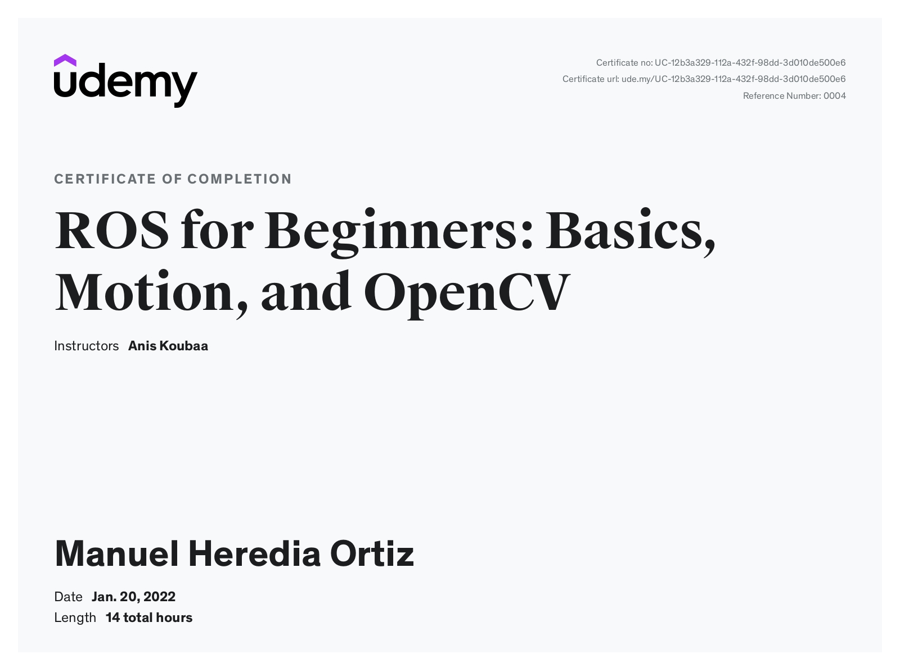
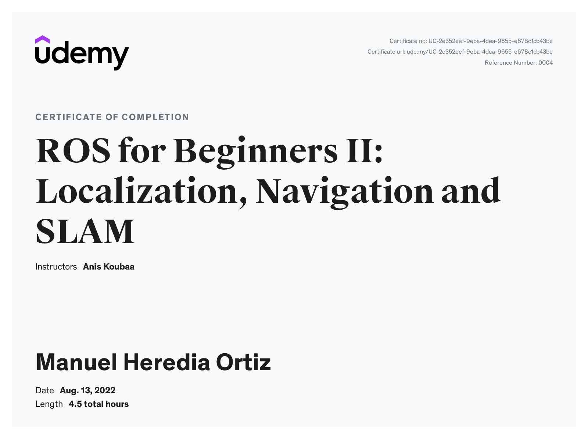

# Notes on ROS

This repo contains my notes, assignments and learning material to get started with ROS.

[ROS 1 cheat sheet](./ROS-notes/0.ROS1-Cheat-Sheet.md)

06/09/22: Added pre-commit hooks to improve code quality. Reformatting is currently WIP. Until the needed reformatting is complete i~~t is possible to commit skipping linting checks with: `$ SKIP=flake8,pylint git commit ...`~~(08/09/22) some checks  of variable names and use of globals are temporarily disabled with `.pylintrc`:

* `C0103`, uppercase naming style for constants
* `W0602`, global-variable-not-assigned
* `W0603`, global-statement
* `W0604`, global-at-module-level 

## ROS for Beginners I: Basics, Motion, and OpenCV

[ROS for Beginners: Basics, Motion, and OpenCV](https://www.udemy.com/course/ros-essentials/)  

Udemy ROS for Beginners course by [Anis Koubaa](https://www.udemy.com/user/anis-koubaa) 

(Purchased on Udemy on 15.07.21 with username spam) 

[Part 1](./ROS-notes/1.ROS-essentials-Nov21-Lessons-1-77.md): ROS basics (Lessons #001-#081)

* [Assignment 1](./ROS-notes/ROS_Assignment_1.md)
* [Assignment 2](./ROS-notes/ROS_Assignment_2.md)
* Assignment 3
* [Assignment 4](./ROS-notes/ROS_Assignment_4.md)

[Part 2](./ROS-notes/2.ROS-essentials-Motion-Nov21-L82-112.md): Motion with ROS (Lessons #082-#113)

* [Assignment 5](./ROS-notes/ROS_Assignment_5.md)

[Part 3](./ROS-notes/3.ROS-essentials-Perception-Dec21-L114.138.md): Perception: Computer vision with OpenCV and laser scanners (L#114-#139)

* [Assignment 6](./ROS-notes/ROS_Assignment_6.md)
* [Assignment 7](./ROS-notes/ROS_Assignment_7.md): **bouncy** and **marauder** obstacle avoidance with Turtlebot3

[Part 4](./ROS-notes/4.ROS-essentials-rosserial-Dec21.md): Arduino bots and sensors with ROS (Lessons #140-#150)

### TO DO on ROS for Beginners I as of 23.08.22

- [ ] Lessons #27 and #28 on virtual machines
- [ ] Lesson #108 on ROS network config
- [ ] Order code in `Arduino` folder 
- [ ] order code in `catkin_ws/src` folder

## ROS for Beginners II: Localization, Navigation and SLAM
[ROS for Beginners II: Localization, Navigation and SLAM](https://www.udemy.com/course/ros-navigation/)

Udemy ROS for Beginners course by [Anis Koubaa](https://www.udemy.com/user/anis-koubaa) 

(Purchased on Udemy on 15.07.21 with username spam) 

[Part 5](./ROS-notes/5.ROS-navigation-Intro-Jan22-L001-035.md): Introduction (Lessons #001 to #035 and **Assignment 1** Quiz)

[Part 6](./ROS-notes/6.ROS-navigation-TF-Jan22-L036-051.md): TF (Lessons #036 to #051 + MiniPupper example)

[Part 7](./ROS-notes/7.ROS-navigation-maps-Apr22-L052-062.md): maps (Lessons #052 to #062)

[Part 8](./ROS-notes/8.ROS-navigation-tuning-Jul22-L063-070.md): navigation parameter tuning (Lessons #063 to #070)

[Part 9](./ROS-notes/9.ROS-navigation-reactive-Aug22-L071-076.md): reactive navigation (Lessons #071 to #076 and **Assignment 2: BUG 0**)

##  ETH Zurich Programming for Robotics (ROS) Course
[2021 Programming for Robotics (ROS) Course homepage](https://rsl.ethz.ch/education-students/lectures/ros.html): ETH Zurich Course 4 lessons + case studies. Videos + course material (lessons, exercises etc) available to download. I originally discovered this course through this Youtube playlist from 2017: [2017 Programming for Robotics (ROS) Course Youtube playlist](https://www.youtube.com/playlist?list=PLE-BQwvVGf8HOvwXPgtDfWoxd4Cc6ghiP). 

[Lesson #1](./ROS-notes/ROS_ETH_Zurich_L1.md)

[Lesson #2](./ROS-notes/ROS_ETH_Zurich_L2.md)

[Lesson #3](./ROS-notes/ROS_ETH_Zurich_L3.md)

## Articulated Robotics

[Articulated Robotics](https://articulatedrobotics.xyz/) is a phenomenal series of blog and video tutorials by Josh Newans including a step by step guide to building your own ROS2-based mobile robot with camera and LIDAR.

[Part 1](./ROS-notes/10.ROS2-Getting-ready-Aug22-L01-XX.md): Getting ready for ROS (Videos #01 - #08 and Extra)

Part 2: Making a Mobile Robot project

## Other ROS resources to check:

* [ROS robotics learning website](https://www.rosroboticslearning.com/) , [youtube video of DIY Jetson nano+ RPLidar robot](https://www.youtube.com/watch?v=Uz_i_sjVhIM) and [github repo](https://github.com/bandasaikrishna/Autonomous_Mobile_Robot)
* [JdeRobot robotics education website](https://jderobot.github.io/projects/robotics_education/) and [Robotics-Academy exercises](https://jderobot.github.io/RoboticsAcademy/exercises/)
* [Exploring ROS using a 2-wheeled robot](https://www.youtube.com/playlist?list=PLK0b4e05LnzY2I4sXWTOA4_82cMh6tL-5) series of 13 videos 10-30' long each by The Construct covering URDF modelling, laser scans, obstacle avoidance, motion planning, wall follower, Bug0, 1 & 2, gmapping.
