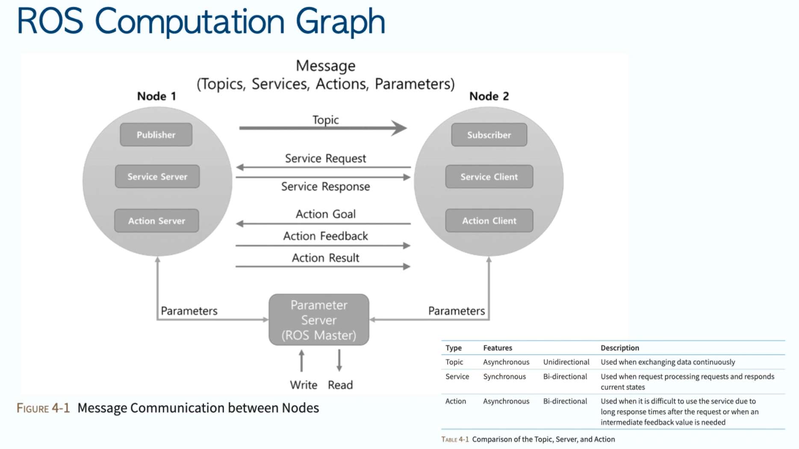
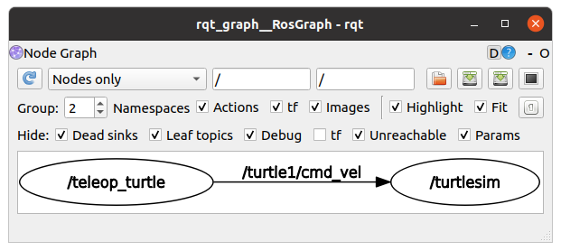
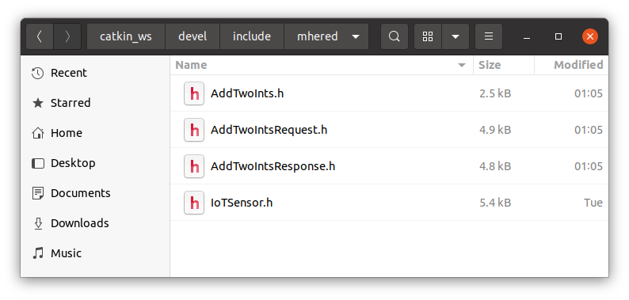

### Why ROS?

ROS provides abstractions that allow separating programming from physical layer

Abstraction of Robot Systems: Sense - Think - Act

ROS provides interface with low level drivers and hardware, kind of standard APIs: turns sensing data into ROS topics and actuations into ROS messages  so you can focus on the Think part.

De facto standard for robotics software development

Middleware 

ROS1 long-time support versions: Indigo, Kinetic, Melodic

ROS2 (current: Dashing) released in 2017 but still not widely used, still in development

### ROS Architecture

ROS is composed of **Nodes**: processes running in a computer (programs)

They are registered in the **ROS Master** (`roscore`): core node. In ROS 1 you run first the ROS master and then nodes can communicate. single point of failure

**Client libraries** (`rospy` for python and `roscpp` for C++). 

Uses **TCP/UDP** for communications

Run on **Linux**

subscriber node: contact master to advertise themselves and declare they want to subscribe to certain types of messages, e.g. velocities, if there are any 

publisher node: idem, describe messages they can publish

master makes the connection, finally nodes connect directly with TCP/UDP

ROS Topic: Publisher --> Topic --> Subscriber : one way

ROS Services: Client Requests Service from Server, wait for Response. Synchronous.

ROS Action Libs: Client Requests Action Goal from Server, continues to do things, is notified by Server of ActionFeedback (e.g. progress) and eventually Action Result. Asynchronous.

Limitations of ROS1: 

* Defined for single robots. Not good for multi-robot cooperation.
* Not real-time. Comms based on TCP/UDP no way to prioritize nodes or messages
* Requires a very reliable network
* ROS master is single point of failure

ROS2 addresses some of these limitations:

* no ROS master. 

* New client libraries

* DDS standard Data Distribution Service replaces TCD/UDP, improves scalability. Industry standard for real-time machine-to-machine comms. Uses publish-subscribe pattern. Used in ATC, smart grid, IoT, financial trading etc. 2 vendors: RTI and Thales 

* Designed cross-platform from the beginning

* Can be used for swarms

* Implements quality of service to prioritize processes and real time guarantees

| DDS vs     | ROS        |
| ---------- | ---------- |
| Domain     | ROS        |
| Topic      | Topic      |
| Instance   | Message    |
| DataWriter | Publisher  |
| DataReader | Subscriber |

Publishers create topics and publish samples. User can specify QoS parameters.

Fully distributed discovery protocols

No vendor lock.

### Installing ROS noetic

followed [these instructions](http://wiki.ros.org/noetic/Installation/Ubuntu) . Installed the Desktop-full Install.

 Note I edited `~/.bashrc` to add `source /opt/ros/noetic/setup.bash` at the end.

then [this tutorial](http://wiki.ros.org/ROS/Tutorials/InstallingandConfiguringROSEnvironment) for configuring

```
$ printenv | grep ROS
ROS_VERSION=1
ROS_PYTHON_VERSION=3
ROS_PACKAGE_PATH=/opt/ros/noetic/share
ROSLISP_PACKAGE_DIRECTORIES=
ROS_ETC_DIR=/opt/ros/noetic/etc/ros
ROS_MASTER_URI=http://localhost:11311
ROS_ROOT=/opt/ros/noetic/share/ros
ROS_DISTRO=noetic
```

create and build a catkin workspace:

```
$ mkdir -p ~/catkin_ws/src
$ cd ~/catkin_ws/
$ catkin_make
```

Now source the new `setup.bash` file  created in `devel`to overlay this workspace on top of your environment.

`$ source ~/catkin_ws/devel/setup.bash`

Note: the teacher added this to `~/.bashrc`  I did not at the beginning but later I did so I don't need to remember to source `$ source ~/catkin_ws/devel/setup.bash`every time!!

Second [tutorial](http://wiki.ros.org/ROS/Tutorials/NavigatingTheFilesystem):

Using catkin
In ROS, code is spread across many ROS packages. Navigating with command-line is tedious but `rospack` allows getting info about packages

### Using packages

Packages: Packages are the software organization unit of ROS code. Each package can contain libraries, executables, scripts, or other artifacts.

Manifests (`package.xml`): A manifest is a description of a package. It serves to define dependencies between packages and to capture meta information about the package like version, maintainer, license, etc... 

`rospack find <package>` find address of a package
`roscd <package>` move to the folder of this package. 

`roscd` w/o parameters takes you to the default workspace
`roscd log` move to the folder where logs are stored
`rosls <package>` make ls in the package folder
Can use TAB completion

Copy files:
`~/catkin_ws/src$ git clone -b ros-noetic https://github.com/aniskoubaa/ros_essentials_cpp.git`

`rosrun ros_essentials_cpp` then double TAB to list the available packages 
listeners - talkers work fine (both python and cpp)

Remember to source `$ source ~/catkin_ws/devel/setup.bash` !

Recommends Visual Studio code as IDE
simply drag & drop folder to open
integrated command line

------

Date: 02.11 

### (#34) ROS workspaces vs ROS packages

Default ROS workspace in `/opt/ros/noetic/`

Inside there are a few `setup.*sh` files for the different shells. Need to execute it before executing ROS. Recommends to add to `~/.bashrc` the line:
`source /opt/ros/noetic/setup.bash`

Not recommended to work in the default workspace. Instead create your own ROS workspace, typically `~/catkin_ws/src` which is the environment and inside create individual projects inside the workspace called ROS packages

To enable your own workspace need to source the `setup.bash` in the `devel` folder .
Do this permanently adding the following line to  ~/.bashrc :
`source /home/mhered/catkin_ws/devel/setup.bash`

workspace has 3 folders:

* `build` compiled files
* `devel` development
* `src` source files

### To create a new project:

 from inside src folder 
`$ catkin_create_pkg <package name> <dependencies>`
Typical dependencies are std libraries, e.g.
`$ catkin_create_pkg ros_basics_tutorials std_msgs rospy roscpp`

Now package is created but needs to compile to complete the creation. From `catkin_ws` folder issue:
`$ catkin_make`

This creates a new folder inside `src`called `ros_basics_tutorial` , containing `src` for the code and `include` for the libraries

Practice: create code in src, edit the `MakeFile.txt` and run `catkin_make`, start the nodes et voilá

### To delete a package (not in the course)

Source: https://answers.ros.org/question/66366/how-to-catkin_make-clean-just-one-package/

* Delete the package folder 
* Remove the `build`, `devel` and `install`folders in `~/catkin_ws` 
* Perform a clean `catkin_make`

```
$ rm -r <path-to-package-folder>
$ cd ~/catkin_ws/
$ rm -r devel
$ rm -r build
$ rm -r install
$ catkin_make
```

Then package no longer found with `$ rospack list` or `$ rospack find <package-name>`

### (#38) ROS computation graph



1. start `roscore`
2. start subscriber e.g. robot turtlesim
3. start publisher node e.g. teleoperator
4. `roscore` will inform both nodes and communication can happen

Pay attention to info displayed:

```
$ roscore
... logging to /home/mhered/.ros/log/e9b5185c-3c35-11ec-932a-b7135784edb0/roslaunch-mhered-laptop-54420.log
Checking log directory for disk usage. This may take a while.
Press Ctrl-C to interrupt
Done checking log file disk usage. Usage is <1GB.

started roslaunch server http://mhered-laptop:35489/
ros_comm version 1.15.13


SUMMARY
========

PARAMETERS
 * /rosdistro: noetic
 * /rosversion: 1.15.13

NODES

auto-starting new master
process[master]: started with pid [54432]
ROS_MASTER_URI=http://mhered-laptop:11311/

setting /run_id to e9b5185c-3c35-11ec-932a-b7135784edb0
process[rosout-1]: started with pid [54445]
started core service [/rosout]

```

Notice: distro and version and ros master uri

 * `/rosdistro: noetic`
 * `/rosversion: 1.15.13`

`ROS_MASTER_URI=http://mhered-laptop:11311/`

`$ rosnode list` list nodes

`$ rostopic list` list topics

### (#41) Run a new node

Run a new node:`$ rosrun <package-name> <node-name>`

Notice package-name ~= folder, node-name ~= file

`$ rosrun turtlesim turtlesim_node`executes the turtlesim robot, that stays waiting for orders. `rosnode list` and `rostopic list` show a new node and 3 new topics

`$ rosrun turtlesim turtle_teleop_key` creates a new node but no new topics (teleop publishes same topics that robot subscribes)

`$ rosnode info /<node-name>` e.g. `$ rosnode info /turtlesim` shows info about node

`$ rostopic info /<topic-name>` e.g. `$ rostopic info /turtle1/cmd_vel` shows info about topic

Note: these two predefined nodes are in the package  `/opt/ros/noetic/lib/turtlesim`

------

Date: 03.11

### (#46) Structure of ROS messages

`$ rosnode info /<package-name>` to get info on a node:

```
$ rosnode info /turtlesim
--------------------------------------------------------------------------------
Node [/turtlesim]
Publications: 
 * /rosout [rosgraph_msgs/Log]
 * /turtle1/color_sensor [turtlesim/Color]
 * /turtle1/pose [turtlesim/Pose]

Subscriptions: 
 * /turtle1/cmd_vel [geometry_msgs/Twist]

Services: 
 * /clear
 * /kill
 * /reset
 * /spawn
 * /turtle1/set_pen
 * /turtle1/teleport_absolute
 * /turtle1/teleport_relative
 * /turtlesim/get_loggers
 * /turtlesim/set_logger_level


contacting node http://mhered-laptop:39383/ ...
Pid: 54718
Connections:
 * topic: /rosout
    * to: /rosout
    * direction: outbound (47347 - 127.0.0.1:33862) [30]
    * transport: TCPROS
 * topic: /turtle1/cmd_vel
    * to: /teleop_turtle (http://mhered-laptop:44069/)
    * direction: inbound (47428 - mhered-laptop:33233) [32]
    * transport: TCPROS
```

If we look at one message, e.g. `/turtle1/cmd_vel [geometry_msgs/Twist]` we see it is described with two words: `[<parent-package> / <message-name>]`

Actually there is a file `Twist.msg` in `/opt/ros/noetic/share/geometry_msgs/msg`:

```#/opt/ros/noetic/share/geometry_msgs/msg/Twist.msg
# This expresses velocity in free space broken into its linear and angular parts.
Vector3  linear
Vector3  angular
```

And in turn `Vector3` is defined in as follows:

```#/opt/ros/noetic/share/geometry_msgs/msg/Vector3.msg
# This represents a vector in free space. 
# It is only meant to represent a direction. Therefore, it does not
# make sense to apply a translation to it (e.g., when applying a 
# generic rigid transformation to a Vector3, tf2 will only apply the
# rotation). If you want your data to be translatable too, use the
# geometry_msgs/Point message instead.

float64 x
float64 y
float64 z
```


Show message structure with `$ rosmsg show <package>/<message>` 

```
mhered@mhered-laptop:~$ rosmsg show geometry_msgs/Twist
geometry_msgs/Vector3 linear
  float64 x
  float64 y
  float64 z
geometry_msgs/Vector3 angular
  float64 x
  float64 y
  float64 z
```

Publish message on a topic through command line:

```
$ rostopic pub -r 10 /turtle1/cmd_vel geometry_msgs/Twist '{linear: {x: 0.1, y: 0.0, z: 0.0}, angular: {x: 0.0, y: 0.0, z: 0.0}} '
```


`$ rosrun rqt_graph rqt_graph` show the ROS computation graph:



`$ rostopic echo <package>/<topic>` to spy on messages sent on a particular topic

`rostopic` + double TAB to see available commands: `bw    echo  find  hz    info  list  pub   type`

`$ rostopic list` -> see all topics

`$ rostopic info <pkg>/<topic>` -> info on a topic

`$ rosmsg show <pkg>/<msg>` -> info on a message

`$ rostopic echo <pkg>/<topic>`-> spy messages published on a topic

`$ rostopic pub -r <repeats> <topic-name> <message-name> <value>` -> to manually publish a message on a topic:


```
$ rostopic pub -r 10 /turtle1/cmd_vel geometry_msgs/Twist '{linear: {x: 0.1, y: 0.0, z: 0.0}, angular: {x: 0.0, y: 0.0, z: 0.0}} '
```

------

Date: 05.11

### Assignment 1

Details in  [Assignment 1](./ROS_Assignment_1.md)

### (#59 onwards) ROS Topics

Note: talker & listener can continue to communicate even is `rosnode` is down

To write a **ROS topic Publisher node **:

1. define name of topic to publish
2. define message type
3. define frequency of topic publication
4. create publisher object
5. start publishing

To write a **ROS topic Subscriber node **:

1. identify topic to listen
2. identify expected message type
3. define callback function that will run every time message is received
4. start listening
5. spin to listen forever

### Hello world

'Talker' publisher node

'Listener' suscriber node

agree on a topic named 'chatter' 

agree on message of type string: defined in std_msgs/Strings

with only one field: data = "Hello World %d" where %d is placeholder for a counter

###  Publisher node

```
import rospy

# create publisher object
from <package>.msg import <msg-type>
<pub_obj> = rospy.Publisher(<topic-name>, <msg-type>, queue_size=q-size)

# create and initialize a node
rospy.init_node(<node-name>, anonymus=True)

# logic

rate = rospy.Rate(<freq-in-Hz>)

i=0
while not rospy.is_shutdown():
	hello_str = "Hello world %s"  % i
	rospy.loginfo(hello_str) # print the message
	pub_obj.publish(hello_str) 
	rate.sleep()
	i+=1
	

```

`queue_size` size of buffer

`anonymous = True` ensures every node is unique

### Subscriber node

```
# create and init listener node
rospy.init_node('listener', anonymous=True)

# create subscriber object (same topic and msg type, using class subscriber)
from std_msgs.msg import String
rospy.Subscriber('chatter', String, chatter_callback)
```

`chatter_callback` is the callback function that is called when a message arrives

```
def chatter_callback(message):
	print("I heard %s", message.data)
```

Start listening:

```
rospy.spin()
```

--------

Date: 08.11

### (#65) Demo talker / listener in python

cpp: faster and safer

python: more libraries

### (#66) Demo talker/listener in C++

Code is similar but less intuitive. I did not pay a lot of attention. 

Main differences: 

1. After initialize you need to create node handles first. 
2. Type of message not defined in Subscriber but in the type of parameter of callback function (C++ is a typed language).
3. Also need to update `CMakeLists.txt` (`add_executable` and `target_link_libraries` for each node) and  `package.xml`(add `<build_depend>` ` <build_export_depend>` and `<exec_depend>` to allow the catkin compiler to locate each library).
4. run `$ catkin make` from `catkin_ws` folder

**It is possible to mix python and cpp nodes!**

### Assignment 2

Details in  [Assignment 2](./ROS_Assignment_2.md)

-----

Date: 09.11

### (#71 - 73) Section 8: ROS Messages

Structure of a message: 

`````
package_name/message_type

type_1 field_1
...
type_n field_n
`````

types can be primitive types of previously defined message names. Refer to [ROS Wiki](http://wiki.ros.org/msg) for info

### Example IoT custom message Publisher/Subscriber: 

1. Create a new package with typical dependencies (std libraries). From inside `~/catkin_ws/src` folder (remember `roscd` takes you quickly to `devel`), issue:

   `$ catkin_create_pkg mhered std_msgs rospy roscpp`

   This creates a new folder `mhered` inside `src` , subfolders  `src` for the code, `include` for the libraries, and populates with manifest `package.xml`, config file `CMakeLists.txt` etc. 

2. Now the package is created but needs to compile to complete the creation. From `catkin_ws` folder issue:
   `$ catkin_make`
   Now you can use normally :
   `rospack find mhered` to find the address: `~/catkin_ws/src/mhered`
   `roscd mhered` to move to the folder
   `rosls mhered` to list files in the package folder

3. create a `msg` folder in the root of your package: `~/catkin_ws/src/mhered/msg/`

4. create a file with `.msg` extension, in this case `IoTSensor.msg`, and define in it the custom message.

```IoTSensor.msg
int32 id
string name
float32 temp
float32 humidity
```

5. update dependencies in `~/catkin_ws/src/mhered/CMakeLists.txt`: 
   1. first, add the library  `message_generation` to the list of dependencies in `find_package(catkin REQUIRED COMPONENTS`
   2. second, uncomment the entry `add_message_files` and add `IoTSensor.msg` to the list of files, see below:

   ```
   # Generate messages in the 'msg' folder
   add_message_files(
   	FILES
   	IoTSensor.msg
   ) 
   ```

   3. **Note: [ROS Wiki](http://wiki.ros.org/msg) asks for two more modifications, one in the entry `catkin_package` (add `message_runtime`) and two, to activate the entry `generate_messages` and list there dependencies of the generated messages, e.g. if the _fieldtypes_ include previously created messages in other packages. This is consistent with the second video and also with instructions in the template CMakeLists.txt. They also mention that the build may work even without these calls (if the calls are already included in another of your projects) but "forgetting the call means your project can easily break ".**

6. in the manifest `package.xml` add the following lines in the appropriate places to update dependencies:

   1. `<build_depend>message_generation</build_depend>` and 
   2. `<exec_depend>message_runtime</exec_depend>`
   3. **Note:  [ROS Wiki](http://wiki.ros.org/msg) asks instead for `<run_depend>message_runtime</run_depend>`**

7. To compile and apply the changes above, issue `$ catkin_make` from  `catkin_ws` folder 

8. now  `$ rosmsg show mhered/IoTSensor` displays the info of the newly created custom message

See the completed example in `~/catkin_ws/src/mhered/iot_publisher.py` and `~/catkin_ws/src/mhered/iot_subscriber.py`  (written independently by me from talker and listener)

### Section 9: ROS Services

### (#74 - 76) How to use services

Remember Topics were unidirectional Publsihjer -> Subscriber

Services are bidireactinal and  **synchronous** communication: Client sends **request**, waits for Server **response**. 

Used when we request a robot to perform an action e.g. spawning

`$ rosservice list` list available services

`$ rosservice info <service>`  to obtain the node providing the service , URI where the server is located, type of service message and arguments for the service request

```
$ rosservice info /spawn
Node: /turtlesim
URI: rosrpc://mhered-laptop:34789
Type: turtlesim/Spawn
Args: x y theta name
```

`$ rossrv info <service-message>` (equivalent to `rosmsg show` for topic messages) to explore the structure of the "service request / server response" messages, separated by `---`. 

```
$ rossrv info turtlesim/Spawn
float32 x
float32 y
float32 theta
string name
---
string name
```

`$ rosservice call <service> <args>` to call a ROS service, e.g. `$ rosservice call /spawn 7 7 0 turtle2`

### Assignment 3

Very easy, usage of services and playing with `/spawn` `/kill` and `/reset` in turtlesim

-----

Date: 11.11

### (# 77) Example: A custom service to add two integers

5 Steps:

1. Define service message
2. Create ROS server node `AddTwoIntsServer`
3. Create ROS client node `AddTwoIntsClient`
4. execute the service
5. consume the service by the client

#### 1. Define service message 

1. (Assuming a project `mhered` is already created in folder, in folder `~/catkin_ws/src/mhered/srv` create a **service definition** file `AddTwoInts.srv` with the message types for request  and response  separated by `---`:

```AddTwoInts.srv
int64 a
int64 b
---
int64 sum 
```

2. if not done, update dependencies in `~/catkin_ws/src/mhered/CMakeLists.txt`: 
   1. Common settings for message generation:
      1.  add the library  `message_generation` to the list of dependencies in `find_package(catkin REQUIRED COMPONENTS`
      2. in the entry `catkin_package`, add `message_runtime` to `CATKIN_DEPENDS` 
      3. activate the entry `generate_messages` and list there dependencies of the generated messages, e.g. if the _fieldtypes_ include previously created messages in other packages. 
   2. uncomment the entry `add_service_files` and add `AddTwoInts.srv` to the list as follows:

```
# Generate services in the 'srv' folder
add_service_files(
	FILES
	AddTwoInts.srv
) 
```

3. in the manifest `~/catkin_ws/src/mhered/package.xml` add the following lines in the appropriate places to update dependencies:
   1. `<build_depend>message_generation</build_depend>` and 
   2. `<exec_depend>message_runtime</exec_depend>`
4. To compile and apply the changes above, issue `$ catkin_make` from  `catkin_ws` folder. This creates three header files inside `devel/include/mhered`: `AddTwoInts.h`, `AddTwoIntsRequest.h` `AddTwoIntsResponse.h` 



`$ rossrv list` lists all servers defined in the workspace

 `$ rossrv show <service-name>` will return the service definition:

```
$ rossrv show mhered/AddTwoInts
int64 a
int64 b
---
int64 sum
```

#### 2. Create ROS server node `AddTwoIntsServer`

See the completed example in `~/catkin_ws/src/mhered/add2ints_server.py` (written by me following videos)

#### 3. Create ROS client node `AddTwoIntsClient`

See the completed example in `~/catkin_ws/src/mhered/add2ints_client.py` (written by me following videos)

#### 4. execute the service

Assuming `roscore` is running:

```
$ rosrun mhered add2ints_server.py
Server is ready to add integers.
```


####  5. consume the service by the client

In a separate terminal

```
$ rosrun mhered add2ints_client.py 1 1
Client will request 1 + 1...
Server returned 1 + 1 = 2
```


___

Date: 12.11

### Assignment 4: ROS Service to calculate area of rectangle

See details in  [Assignment 4](/home/mhered/Desktop/udemy-ROS-course/ROS_Assignment_4.md)

