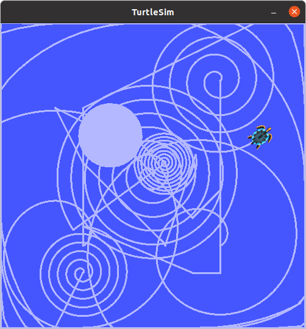
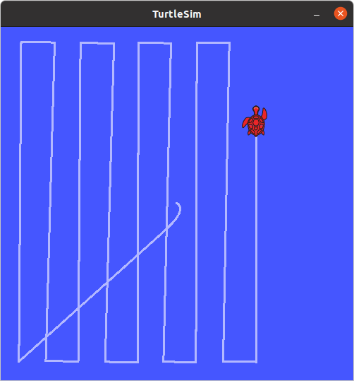
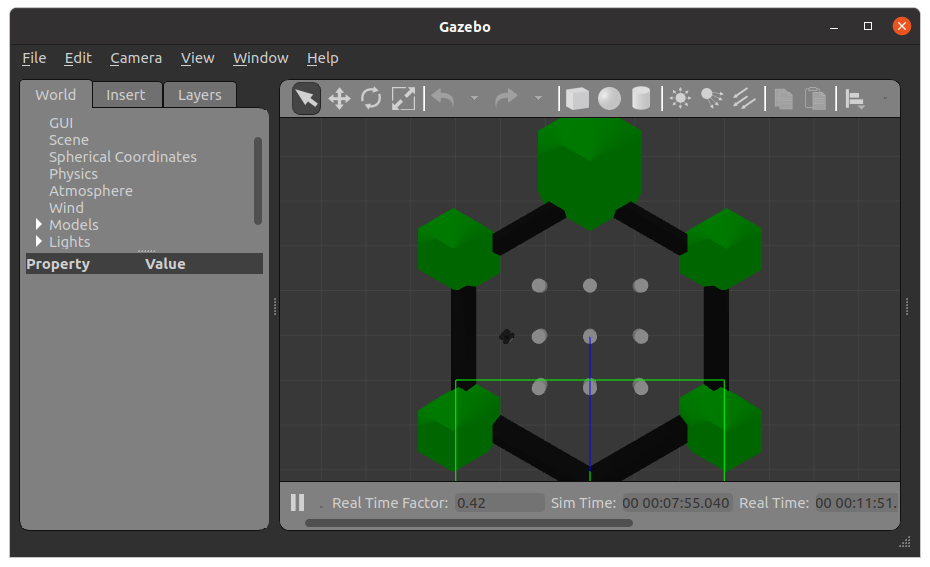

### (#82 - ) Section 10: Motion in ROS

Motion is described by the `Twist` message. However for 2D non-holonomic robots you only need `linear.x` (speed) and `angular.z` (omega around z-axis)

Note: All values are by default 0 unless specified otherwise

Example application: cleaning robot. Divide and conquer strategy: develop several simple methods then integrate all. Four elementary trajectories:

1. Motion in straight line (forward and backward). `linear.x = CONSTANT_SPEED`

```
Linear:
    x: CONSTANT_SPEED
    y: 0
    z: 0
Angular:
    x: 0
    y: 0
    z: 0
```

2. Rotation in place (clockwise and counter-clockwise) `angular.z = CONSTANT_SPEED`

```
Linear:
	x: 0
	y: 0
	z: 0
Angular:
	x: 0
	y: 0
	z: CONSTANT_SPEED
```

3. Go to goal `linear.x = PID(distance)`, `angular.z = PID(delta_orientation)`  

```
Linear:
	x: PID(distance_to_goal)
	y: 0
	z: 0
Angular:
	x: 0
	y: 0
	z: PID(delta_orientation)
```

4. Spiral `linear.x = f(time)`, `angular.z = CONSTANT_SPEED`  

```
Linear:
	x: f(time)
	y: 0
	z: 0
Angular:
	x: 0
	y: 0
	z: CONSTANT_SPEED
```

5. integrate all in a cleaning application

Launch `turtlesim` and inspect topics and messages

```bash
$ roscore
$ rosrun turtlesim turtlesim_node 
$ rostopic list
/rosout
/rosout_agg
/turtle1/cmd_vel
/turtle1/color_sensor
/turtle1/pose

$ rostopic info /turtle1/cmd_vel
Type: geometry_msgs/Twist

Publishers: None

Subscribers: 
 * /turtlesim (http://mhered-laptop:43561/)

$ rosmsg show geometry_msgs/Twist
geometry_msgs/Vector3 linear
  float64 x
  float64 y
  float64 z
geometry_msgs/Vector3 angular
  float64 x
  float64 y
  float64 z

```

Pose topic captures location orientation and velocity in 2D

```bash
$ rostopic info turtle1/pose
Type: turtlesim/Pose

Publishers: 
 * /turtlesim (http://mhered-laptop:43561/)

Subscribers: None

$ rosmsg show turtlesim/Pose
float32 x
float32 y
float32 theta
float32 linear_velocity
float32 angular_velocity

```

x, y are spatial coordinates

theta is yaw (orientation around z with origin in x axis

`Pose.linear_velocity` = `Twist.linear.x`

`Pose.angular_velocity` = `Twist.angular.z`

Import libraries:

```python
import rospy
from geometry_msgs.msg import Twist
from turtlesim.msg import Pose
```

###  (#87) Straight motion

from x0, y0 to x,y

Write `move()`

----

Date 15.11

### Cleaning app

#### Create package

```bash
~/catkin_ws/src$ catkin_create_pkg cleaning_robot std_msgs rospy roscpp
Created file cleaning_robot/package.xml
Created file cleaning_robot/CMakeLists.txt
Created folder cleaning_robot/include/cleaning_robot
Created folder cleaning_robot/src
Successfully created files in /home/mhered/catkin_ws/src/cleaning_robot. Please adjust the values in package.xml.

```

#### Not Needed: Update dependencies in `CMakeLists.txt`

In `~/catkin_ws/src/cleaning_app/CMakeLists.txt`: 

1. in `find_package(catkin REQUIRED COMPONENTS`add add the library  `message_generation` to the list of dependencies 
2. in the entry `catkin_package`, add `message_runtime` to `CATKIN_DEPENDS` 
3. activate the entry `generate_messages` and list there dependencies of the generated messages, e.g. if the _fieldtypes_ include previously created messages in other packages. 

#### Not Needed: Update dependencies in `package.xml`

1. in the manifest `~/catkin_ws/src/mhered/package.xml` add the following lines in the appropriate places to update dependencies:
   1. `<build_depend>message_generation</build_depend>` and 
   2. `<exec_depend>message_runtime</exec_depend>`

#### Compile

```bash
~/catkin_ws$ catkin_make
```

Write `move()`


----

Date: 16.11

(#89 - 107)

Finish `rotate()`, `go_to()`

Read about `set_orientation()` and `spiral()`

Read about launch files


----

Date: 17.11

Write `spiral()`,  `set_orientation()` , integration in  `cleaner()`





#### (#107) Moving from `turtlesim` to Turtlebot 2 (and beyond) 

Install Turtlebot2:

```
$ sudo apt-get install ros-noetic-turtlebot-*
```

Launch with:

```
$ roslaunch turtlebot_stage turtlebot_in_stage.launch
```

Does not work for me. Turtlebot2 seems deprecated in Noetic, apparantly yo uneed to build from source, [see this gist](https://gist.github.com/DanManN/48ab84c977a3815cacc542835a60dbd7). Not worth it.

Main idea: it should be possible to adapt the cleaner.py code to move a real or simulated robot just replacing the topic name in the subscriber to the appropiate topic where robot Pose is published, and the name of the topic where Twist command messages need to be publsihed to operate the robot. I started `turtlebot2.py` but didn't get to test it in Turtlebot2

**To do: test i in Turtlebot3? **

####  (#109-#110) Launch files

* by convention `.launch` extension

* allow to launch multiple nodes 

* XML file that specifies:

  *  nodes to launch 
  * parameters to send to the nodes
  * may include existing launch files

* executed with `$ roslaunch <package> <launch-file>`

  

e.g. create launch file `my_turtle.launch` in `~/catkin_ws/src/mhered/launch`, i.e. in the`mhered` package:

```xml
<launch>
	<node pkg="turtlesim" type="turtlesim_node" name="my_turtle_node" />
    <node pkg="turtlesim" type="turtle_teleop_key" name="my_turtle_teleop" />
</launch>	
```

* `pkg` package name (not folder)

* `type` node (filename)

* `name` custom name for the node in this instance

Can be launched with:

```
$ roslaunch cleaning_robot cleaner.launch
```

Allows to run  `roscore` and two other nodes with a single command without the need to open several terminals. Launches the nodes with custom names:

```
$ rosnode list
/my_turtle_node
/my_turtle_teleop
/rosout
```

`roslaunch` has autocomplete. Note: provide <package-name>, not folder. 

Allows also to launch other launch files.

e.g. create launch file `my_turtle.launch` in `~/catkin_ws/src/mhered/launch`, i.e. in the `mhered` package:

```xml
<launch>
	<include file="$(find mhered)/launch/my_turtle.launch"/>
    <node pkg="cleaning_robot" type="cleaner_robot.py" name="mh_cleaner_node" />
</launch>	
```


---

Note: on 12.01.2022 I decided to remove the `cleaning_robot` package and move the code to `mhered` package. 

Launch files allow also to define parameters to send to the nodes. Note: define parameters **before** calling the node

e.g. create launch file `cleaner_param.launch` in `~/catkin_ws/src/mhered/launch`, i.e. in the `mhered` package:

```xml
<launch>
	<include file="$(find mhered)/launch/my_turtle.launch"/>

    <param name ="WAIT" value="0.1"/>
	<param name ="LIN_SPEED" value="6.0"/>
	<param name ="ROT_SPEED" value="120.0"/>

	<node pkg="mhered" type="cleaner_robot.py"
		name="cleaner_node" output = "screen"/>
</launch>

```

Modify `cleaner_robot.py` to accept parameters `x_goal` and `y_goal` and set the defaults in case parameters are not provided:

```python
# get ROS parameters (or default)
WAIT = rospy.get_param("WAIT", 0.5)
LIN_SPEED = rospy.get_param("LIN_SPEED", 4.0)
ROT_SPEED = rospy.get_param("ROT_SPEED", 30.0)

# call the function
cleaner_app(velocity_publisher, WAIT, LIN_SPEED, ROT_SPEED)
```


### Read (#108) Network config but didn't understand it


---

Date: 25.11

### Install Turtlebot3 (#111-#113)

```bash
$ sudo apt-get update
$ sudo apt-get upgrade
```

From `~/catkin_ws/src/` issue `git clone` to download the core **Turtlebot3** packages:

```bash
$ git clone https://github.com/ROBOTIS-GIT/turtlebot3_msgs.git -b noetic-devel
$ git clone https://github.com/ROBOTIS-GIT/turtlebot3-.git -b noetic-devel
```

Issue `$ catkin_make` from `~/catkin_ws/` to compile. 

**After compilation**, download simulation packages: from `~/catkin_ws/src/`issue:

```bash
$ git clone https://github.com/ROBOTIS-GIT/turtlebot3_simulations.git -b noetic-devel
```

Again, issue `$ catkin_make` from `~/catkin_ws/` to compile. 

Edit`~/.bashrc` (if notalready done) so last lines are:

```
source /opt/ros/noetic/setup.bash
source /home/mhered/catkin_ws/devel/setup.bash

```

`export TURTLEBOT3_MODEL=waffle` to set the default robot (can be also `burger`)

`export SVGA_VGPU10=0` to avoid crashing when opening gazebo in virtual machine

Recommended also to add aliases in the proper section for convenience:

```
alias burger='export TURTLEBOT3_MODEL=burger'
alias waffle='export TURTLEBOT3_MODEL=waffle'
alias tb3fake='roslaunch turtlebot3_fake turtlebot3_fake.launch'
alias tb3teleop='roslaunch turtlebot3_teleop turtlebot3_teleop_key.launch'
alias tb3='roslaunch turtlebot3_gazebo turtlebot3_empty_world.launch'
alias tb3maze='roslaunch turtlebot3_gazebo turtlebot3_world.launch'
alias tb3house='roslaunch turtlebot3_gazebo turtlebot3_house.launch'
```

E.g. to control robot with keys in a maze world visualizing in **RVIZ** (lidar + camera):

Terminal 1:`$ tb3maze`

Terminal 2:`$ roslaunch turtlebot3_gazebo turtlebot3_gazebo_rviz.launch`

Terminal 3:`$ tb3teleop`




E.g. SLAM for MAP building:

Terminal 1:`$ roslaunch turtlebot3_slam turtlebot3_slam.launch slam_methods:=gmappping`

Terminal 2:`$ tb3teleop`
