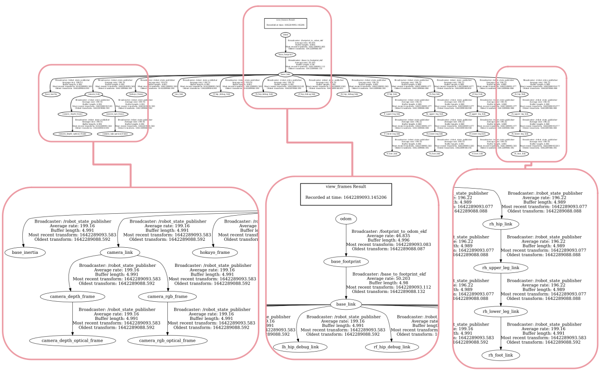

### (#036-49) TF package

TF: transformation library in ROS

Performs the computations for transformations between frames, allowing to compute the pose of any object in any frame. Also provides an API for python and C++ to publish and listen to frames in ROS.

ROS convention for axes: X: red. Y: Green, Z: Blue

A robot is defined as collection of frames attached to its different joints and components. URDF: unified robot description format, XML file that describes the robot, see http://wiki.ros.org/urdf/Tutorials

Some ROS nodes in TF package that provide utilities:

#### `view_frames` 

Graphical debugging tool that saves in PDF a graph of the current full tree of transform frames

Formerly `$ rosrun tf view_frames`,  it is deprecated in **ROS Noetic**. We need to install the package `tf2_tools` with:

```
$ sudo apt-get install ros-noetic-tf2-tools
```

Then run it with:

```
$ rosrun tf2_tools view_frames.py
```

Typical usage is to generate the PDF then view it, e.g. on standard PDF visor  `evince`:

```
$ evince frames.pdf
```

Hence it is useful to add the following shortcut to `.bashrc`.

(**ROS Noetic** version):

```
alias tf='cd /var/tmp && rosrun tf2_tools view_frames.py && evince frames.pdf &'
```

Note the tree starts with:

* `map` global frame

* `odom` frame relative to odometry

* `base_footprint` attached to the base of the robot at its centre


#### `tf_monitor`

Monitor transforms between frames

```bash
$ rosrun tf tf_monitor <source frame> <target frame>
```

Without parameters shows all transformations:

```bash
$ rosrun tf tf_monitor
```

#### `tf_echo`

Prints to screen the specified transform between any two frames

```bash
$ rosrun tf tf_echo <source frame> <target frame> <broadcast freq in Hz>
```

Provides translation and rotation (in quaternion, RPY (roll-pitch-yaw))

#### `static_transform_publisher`

Command line tool to send static transforms:

```bash
$ rosrun tf static_transform_publisher <t_x> <t_y> <t_z> <yaw> <roll> <pitch> <parent frame> <frame_2> <broadcast freq in Hz>
```

(t_x t_y t_z) is the translation vector

Note order of Euler angles is YRP

Example:

```bash
$ rosrun tf static_transform_publisher 1 2 3 0.1 0.2 0.3 frame_a frame_b 10
```

The same through a launch file:

```xml
<launch>
	<node pkg="tf" type="static_transform_publisher" name="frame_a to frame_b"
	args="1 2 3 0.1 0.2 0.3 frame_a frame_b 10" />
</launch>
```


#### See also

*  `rqt_tf_tree` that allows dynamic introspection of the tree
* `roswtf`: with the `tfwtf` plugin helps debug `tf` issues

### 

Convention: TF methods use angles in radians

```python
import math
import tf

roll = math.radians(25.0)
pitch = math.radians(30.0)
yaw = math.radians(45.0)

quaternion = tf.transformations.quaternion_from_euler(roll, pitch, yaw)
rpy = tf.transformations.euler_from_quaternion(quaternion)
roll=math.degrees(rpy[0])
pitch=math.degrees(rpy[1])
yaw=math.degrees(rpy[2])
```

Two topics represent robot location and orientation:

`/odom` (re. odometry)

uses `nav_msgs/OdometryMessage`  messages including a `Header`, a `geometry_msgs/PoseWithCovariance` (position, orientation represented by a quaternion and covariances) and a `geometry_msgs/TwistWithCovariance`(linear velocities, angular velocities and covariances)

 `/acml_pose` (global location re. `map` frame)

uses `geometry_msgs/PoseWithCovarianceStamped` messages ingluding a `Header` and a `geometry_msgs/PoseWithCovariance` (position, orientation represented by a quaternion and covariances )

### Testing TF on the minipupper

Launch the Mini Pupper driver:

```bash
Terminal 1:$ roslaunch mini_pupper_config bringup.launch rviz:=true
```

And the teleop node on a second terminal:

```bash
Terminal 2:$ roslaunch champ_teleop teleop.launch
```

Lets see the frames in action. In **RVIZ**: 

* Global Options -> Background Color -> choose dark color

* Robot Model -> Alpha -> 0.5

* TF -> Show Names -> tick; Show Axes -> tick; Show Arrows -> untick

* TF -> Frames -> tick only odom, base, one leg, cameras and hokuyo


```bash
$ rosnode list
/base_to_footprint_ekf
/champ_controller
/champ_teleop
/footprint_to_odom_ekf
/nodelet_manager
/robot_state_publisher
/rosout
/rviz
/state_estimator
/velocity_smoother
```


```bash
$ rostopic list
/base_to_footprint_pose
/body_pose
/body_pose/raw
/clicked_point
/cmd_vel
/cmd_vel/smooth
/diagnostics
/foot
/foot_contacts
/imu/data
/initialpose
/joint_group_position_controller/command
/joint_states
/joy
/move_base_simple/goal
/nodelet_manager/bond
/odom
/odom/local
/odom/raw
/pose_debug
/rosout
/rosout_agg
/set_pose
/tf
/tf_static
/velocity_smoother/parameter_descriptions
/velocity_smoother/parameter_updates$ 
```

Lets get the full  tree of transformation frames

```bash
$ rosrun tf2_tools view_frames.py
$ evince frames.pdf &
```

[Frames.pdf](./assets/sources/frames.pdf)



Monitor the frames

```bash
$ rosrun tf tf_monitor
...

RESULTS: for all Frames

Frames:
Frame: /base_inertia published by unknown_publisher Average Delay: -0.492651 Max Delay: 0
Frame: /camera_depth_frame published by unknown_publisher Average Delay: -0.492652 Max Delay: 0
Frame: /camera_depth_optical_frame published by unknown_publisher Average Delay: -0.492651 Max Delay: 0
Frame: /camera_link published by unknown_publisher Average Delay: -0.492651 Max Delay: 0
Frame: /camera_rgb_frame published by unknown_publisher Average Delay: -0.49265 Max Delay: 0
Frame: /camera_rgb_optical_frame published by unknown_publisher Average Delay: -0.492653 Max Delay: 0
Frame: /hokuyo_frame published by unknown_publisher Average Delay: -0.492652 Max Delay: 0
Frame: /imu_link published by unknown_publisher Average Delay: -0.49265 Max Delay: 0
Frame: /lf_foot_link published by unknown_publisher Average Delay: -0.492649 Max Delay: 0
Frame: /lf_hip_debug_link published by unknown_publisher Average Delay: -0.492649 Max Delay: 0
Frame: /lf_hip_link published by unknown_publisher Average Delay: 0.0105443 Max Delay: 0.0506384
Frame: /lf_lower_leg_link published by unknown_publisher Average Delay: 0.0105473 Max Delay: 0.0506395
Frame: /lf_upper_leg_link published by unknown_publisher Average Delay: 0.0105493 Max Delay: 0.0506406
Frame: /lh_foot_link published by unknown_publisher Average Delay: -0.492646 Max Delay: 0
Frame: /lh_hip_debug_link published by unknown_publisher Average Delay: -0.492647 Max Delay: 0
Frame: /lh_hip_link published by unknown_publisher Average Delay: 0.0105513 Max Delay: 0.0506417
Frame: /lh_lower_leg_link published by unknown_publisher Average Delay: 0.0105531 Max Delay: 0.0506428
Frame: /lh_upper_leg_link published by unknown_publisher Average Delay: 0.0105549 Max Delay: 0.0506438
Frame: /rf_foot_link published by unknown_publisher Average Delay: -0.492644 Max Delay: 0
Frame: /rf_hip_debug_link published by unknown_publisher Average Delay: -0.492645 Max Delay: 0
Frame: /rf_hip_link published by unknown_publisher Average Delay: 0.0105567 Max Delay: 0.0506448
Frame: /rf_lower_leg_link published by unknown_publisher Average Delay: 0.0105587 Max Delay: 0.050646
Frame: /rf_upper_leg_link published by unknown_publisher Average Delay: 0.0105606 Max Delay: 0.0506471
Frame: /rh_foot_link published by unknown_publisher Average Delay: -0.492641 Max Delay: 0
Frame: /rh_hip_debug_link published by unknown_publisher Average Delay: -0.492642 Max Delay: 0
Frame: /rh_hip_link published by unknown_publisher Average Delay: 0.0105626 Max Delay: 0.0506482
Frame: /rh_lower_leg_link published by unknown_publisher Average Delay: 0.0105647 Max Delay: 0.0506492
Frame: /rh_upper_leg_link published by unknown_publisher Average Delay: 0.0105667 Max Delay: 0.0506505
Frame: base_footprint published by unknown_publisher Average Delay: 0.0103559 Max Delay: 0.0424463
Frame: base_link published by unknown_publisher Average Delay: -0.0320879 Max Delay: 0

All Broadcasters:
Node: unknown_publisher 483.715 Hz, Average Delay: -0.198586 Max Delay: 0.0506444

```

Check one transformation in particular:

```bash
$ rosrun tf tf_monitor odom base_link
...
RESULTS: for /odom to /base_link
Chain is: 
Net delay     avg = 0.0205389: max = 0.0565902

Frames:

All Broadcasters:
Node: unknown_publisher 491.853 Hz, Average Delay: -0.197007 Max Delay: 0.0516306

```

And the actual values, changing as you move the robot:

```bash
$ rosrun tf tf_echo odom base_link 1 
At time 1642291616.111
- Translation: [1.718, 0.015, 0.045]
- Rotation: in Quaternion [0.000, 0.000, -0.225, 0.974]
            in RPY (radian) [0.000, 0.000, -0.453]
            in RPY (degree) [0.000, 0.000, -25.978]

```
