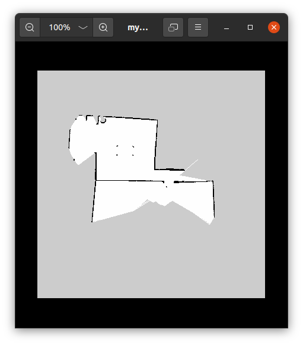

### (#52) Mobile robot navigation

Ability to move in space avoiding obstacles (static or dynamic)

Solving robot navigation involves answering 3 questions: Where am I? Where am I going? How do I get there? 

Two categories:

* Map-based navigation: the robot uses a map of environment, i.e. it has apriori knowledge of the global environment and obstacles and uses it to plan the path to the destination 
* Reactive navigation: the robot uses only local info from its surroundings obtained from sensors

### (#53) Map-based navigation

3 fundamental navigation functions to answer the 3 questions:

* Where am I? i.e. **Localization**: the  robot needs to obtain its location expressed as symbolic reference relative to the local environment e.g. "centre of the room", as topological coordinates e.g. "room 23", or in absolute coordinates. This is obtained from some sensor input e.g. GPS, laser range finders, cameras, ultrasound sensors, received signal strength, etc.  

* Where am I going? i.e. Finding the destination location. In map-based navigation the robot uses a map to recognize its environment and provide meaning to directions and locations. The associated function is **Mapping**:  the map can be loaded manually in memory e.g. with a graph or matrix representation, or generated gradually during exploration. 
* How do I get there? i.e. **Motion planning (or Path planning)**: planning the path to the destination avoiding obstacles. Requires specifying well the goal pose/target destination, either using coordinates absolute (in global frame) or relative (e.g. in the robot frame), or some other addressing scheme understood by the robot e.g "go to room 23". 

**SLAM (Simultaneous Localization And Mapping)** is the process of building a map from range sensors while the robot is exploring an unknown area. Range sensors measure distance to obstacles relative to the robot and store them in a data structure that the robot keeps updating as it moves, based on the estimations of its own location and the distance to obstacles. This process typically uses sensor fusion and filtering techniques e.g. Kalman, particle filters to merge range sensor measurements and odometry and attenuate errors to improve the estimation.

Three main ROS packages in the navigation/SLAM stack:

* `move_base`: allows the robot to navigate in a map towards a goal pose with respect to a given reference frame

* `gmapping`: creates a map using laser scan data

* `amcl`:  localization using an existing map


### (#54) SLAM Demo

1. #### Launch the gazebo simulation environment for Turtlebot3 waffle in a house scenario:

```bash
$ export TURTLEBOT3_MODEL=waffle
$ roslaunch turtlebot3_gazebo turtlebot3_house.launch
```

2. #### Launch SLAM:   

```bash
$ roslaunch turtlebot3_slam turtlebot3_slam.launch slam_methods:=gmapping
```

ROS support several SLAM packages implementing different algorithms, e.g. :

* `gmapping`: a ROS wrapper for OpenSLAM's gmapping algorithm for laser-based SLAM. ([Docs](http://wiki.ros.org/gmapping))
* `cartographer`: real-time 2D & 3D SLAM by Google for multiple platforms & sensor configurations ([Docs](https://google-cartographer-ros.readthedocs.io/en/latest/))
* `hector_slam`: does not require odometry ([Docs](http://wiki.ros.org/hector_slam))

Here we use `gmapping`. This package can build a 2D occupancy grid map from laser range sensor data and pose data collected by a mobile robot. 

The map is a 2D matrix representing a grid of cells (size depends on resolution e.g. 50cm ). Each cell has 3 possible states: Unknown (-1, gray), Empty (1, white) or Occupied (0, black) 

Initially all cells are marked as Unknown meaning unexplored or yet undecided. The robot starts laser scanning. In every scan, it measures the distance to the obstacles and marks cells corresponding to the obstacle as occupied and all others in the path as free. Sometimes laser feedback is not accurate (e.g. obstacle out of range) so cells remain in unknown state. 

In practice for each cell a probability of occupancy 0-100% is calculated and thresholds are defined to determine when a cell can be marked empty or occuppied

3. #### Launch Teleop:

```bash
$ roslaunch turtlebot3_teleop turtlebot3_teleop_key.launch
```

Move the robot  around using the keyboard to build the map while moving. Uses odometry to update robot pose and interpret position of obstacles as it builds the map. Tb3 has a good laser scanner: 4m range, 360deg.

4. #### (#55) Save the map generated:

```bash
$ rosrun map_server map_saver -f ./mymap
```

This generates a [`mymap.pgm`](./assets/sources/mymap.pgm) image file and a  [`mymap.yaml`](./assets/sources/mymap.yaml) metadata file in the current directory. 

Header of the example `mymap.pgm` showing file format, resolution, image size and grayscale range (max value) 

```
P5
# CREATOR: map_saver.cpp 0.050 m/pix
384 384
255
ÍÍÍÍÍÍÍÍÍÍÍÍÍÍÍÍÍÍÍÍÍÍÍÍÍÍÍÍÍÍÍÍÍÍÍÍÍÍÍÍÍÍÍÍÍÍÍÍÍÍÍÍÍÍ...
```



Example `mymap.yaml` showing path to the PGM file, its resolution, thresholds for free and occupied cells, etc to make grayscale image to binary

```yaml
image: ./mymap.pgm # path to PGM image file: stores values P=0-255
resolution: 0.050000 # in m/pixel
origin: [-10.000000, -10.000000, 0.000000] #2D pose of lower left pixel in image as [x,y,yaw] +yaw is countercockwise rotation
negate: 0 # if 1 B&W are reverted
occupied_thresh: 0.65 # pixels with P > 0.65*255 are occupied
free_thresh: 0.196 # pixels with P < 0.196*255 are free
```

### (#56) SLAM launch file

Remember the command to launch SLAM was:

```bash
$ roslaunch turmtlebot3_slam turtlebot3_slam.launch slam_methods:=gmapping
```

So lets open the `turtlebot3_slam.launch` launch file from package `turtlebot3_slam`. We can find it with:

```bash
$ roscd turtlebot3_slam 
$ cd launch
$ gedit turtlebot3_slam.launch
```

Set default arguments, launch the robot (as defined by environment variable `TURTLEBOT3_MODEL`) using bringup, start the SLAM stack depending on the method selected, with `gmapping` as default, launch RVIZ unless set to false.

Bringup launches the robot model and the state publisher node (broadcasts the frames and transformation based on URDF model)

```xml
<launch>
  <!-- Arguments -->
  <arg name="model" default="$(env TURTLEBOT3_MODEL)" doc="model type [burger, waffle, waffle_pi]"/>
  <arg name="slam_methods" default="gmapping" doc="slam type [gmapping, cartographer, hector, karto, frontier_exploration]"/>
  <arg name="configuration_basename" default="turtlebot3_lds_2d.lua"/>
  <arg name="open_rviz" default="true"/>

  <!-- TurtleBot3 -->
  <include file="$(find turtlebot3_bringup)/launch/turtlebot3_remote.launch">
    <arg name="model" value="$(arg model)" />
  </include>

  <!-- SLAM: Gmapping, Cartographer, Hector, Karto, Frontier_exploration, RTAB-Map -->
  <include file="$(find turtlebot3_slam)/launch/turtlebot3_$(arg slam_methods).launch">
    <arg name="model" value="$(arg model)"/>
    <arg name="configuration_basename" value="$(arg configuration_basename)"/>
  </include>

  <!-- rviz -->
  <group if="$(arg open_rviz)"> 
    <node pkg="rviz" type="rviz" name="rviz" required="true"
          args="-d $(find turtlebot3_slam)/rviz/turtlebot3_$(arg slam_methods).rviz"/>
  </group>
</launch>
```

If we inspect the `turtlebot3_gmapping.launch` file:

```xml
<launch>
  <!-- Arguments -->
  <arg name="model" default="$(env TURTLEBOT3_MODEL)" doc="model type [burger, waffle, waffle_pi]"/>
  <arg name="configuration_basename" default="turtlebot3_lds_2d.lua"/>
  <arg name="set_base_frame" default="base_footprint"/>
  <arg name="set_odom_frame" default="odom"/>
  <arg name="set_map_frame"  default="map"/>

  <!-- Gmapping -->
  <node pkg="gmapping" type="slam_gmapping" name="turtlebot3_slam_gmapping" output="screen">
    <param name="base_frame" value="$(arg set_base_frame)"/>
    <param name="odom_frame" value="$(arg set_odom_frame)"/>
    <param name="map_frame"  value="$(arg set_map_frame)"/>
    <rosparam command="load" file="$(find turtlebot3_slam)/config/gmapping_params.yaml" />
  </node>
</launch>
```

Set names of three main frames mandatory for navigation: `base_frame` (robot frame), `odom_frame` (odometry) and `map_frame` (global reference frame), robot model, then loads the parameters file, see full description in [gmapping docs](http://wiki.ros.org/gmapping). If we inspect `turtlebot3_slam/config/gmapping_params.yaml`:

```yaml
map_update_interval: 2.0
maxUrange: 3.0
sigma: 0.05
kernelSize: 1
lstep: 0.05
astep: 0.05
iterations: 5
lsigma: 0.075
ogain: 3.0
lskip: 0
minimumScore: 50
srr: 0.1
srt: 0.2
str: 0.1
stt: 0.2
linearUpdate: 1.0
angularUpdate: 0.2
temporalUpdate: 0.5
resampleThreshold: 0.5
particles: 100
xmin: -10.0 # map offsets: min are coords of the bottom left corner of the map
ymin: -10.0
xmax: 10.0 # max are coords of the top right corner of the map
ymax: 10.0
delta: 0.05 # map resolution is set here!
llsamplerange: 0.01
llsamplestep: 0.01
lasamplerange: 0.005
lasamplestep: 0.005
```

### (#57) Map-based navigation demo

Here!

### (#60) A ROS node in python for navigation 

Note: not tested

```python
#!/usr/bin/env python

import rospy
import actionlib
from move_base_msgs.msg import MoveBaseAction, MoveBaseGoal
from math import radians, degrees
from actionlib_msgs.msg import *
from geometry_msgs.msg import Point

def move_to_goal(xGoal, yGoal):
    # move_to_goal() - method to move the robot to the goal location
    
	# define an actionlib client to send goal requests to the move_base server
	ac= actionlib.SimpleActionClient("move_base", MoveBaseAction)

	# wait for action server to come up
	while(not ac.wait_for_server(rospy.Duration.from_sec(5.9))):
		rospy.loginfo("Waiting for the move_base action server to come up")

	# create object of type MoveBaseGoal
	goal = MoveBaseGoal()

	# set up the reference frame and time stamp
	goal.target_pose.header.frame_id = "map"
	goal.target_pose.header.stamp = rospy.Time.now()

	# define goal
	goal.target_pose.pose.position = Point(xGoal, yGoal,0)
	goal.target_pose.pose.orientation.x = 0.0
	goal.target_pose.pose.orientation.y = 0.0
	goal.target_pose.pose.orientation.z = 0.0
	goal.target_pose.pose.orientation.w = 1.0

	rospy.loginfo("Sending goal location...")
	ac.send_goal(goal)

    # wait 60secs to reach destination
	ac.wait_for_result(rospy.Duration(60))

	if(ac.get_state() == GoalStatus.SUCCEEDED):
		rospy.loginfo("You have reached the destination")
		return True
	else:
		rospy.loginfo("The robot failed to reach the destination")
	return False

if __name__ == '__main__':
	rospy.init_node('map_navigation', anonymous=False)
	# specify coordinates of goal location
    x_goal = -2.028
	y_goal = 4.022
	print('start go to goal')
	
    # call custom method
    move_to_goal(x_goal, y_goal)
	rospy.spin()
```

#### How to determine the coordinates of the goal pose using **RVIZ**

1. Visually counting grid cells from centre (each grid cell is 1m)
2. Reading from `ìnitialpose`topic

 With the robot running open a terminal and type:
 ```bash
 $ rostopic echo initialpose
 ```

 Then select a new pose in **RVIZ** using **2D pose estimate**
 Take note of the x,y coordinates and heading
 Note that `initialpose` is published only when selecting a new pose with **2D pose estimate**. 
 On the other hand `acml_pose` always shows the current location of the robot on the map: 

 ```bash
 $ rostopic echo amcl_pose
 ```

#### Create an `actionlib` client to communicate with `move_base`

 The [`actionlib`](http://wiki.ros.org/actionlib) package provides support for client-server applications where tasks are preemptable i.e. can be interrupted. Communication is asynchronous: the client sends requests to the server and can continue running while  waiting for the response. Server may also send intermediate feedback to  the client before the final result. 
 `move_base` has the global and local path planners and is an `actionlib` not a service so that the robot can do other tasks while navigating.

#### `move_base` default recovery behaviors
 If robot is stuck during navigation due to obstacles or narrow passages it will switch to configurable recovery behaviors: 

* conservative reset: clear out obstacles within a given region
* clearing rotation: in place rotation
* aggressive reset
* clearing rotation
* abort

### Reactive navigation
