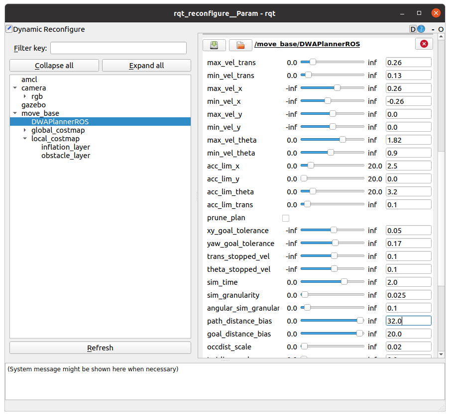

## Section 8 (#63-70): Systematic tuning of navigation stack parameters to optimize performance

Recommended source: [ROS navigation tuning guide by Kaiyu Zheng](./course-materials/063-navguide.pdf), original here: https://kaiyuzheng.me/documents/navguide.pdf

Local path planner produces twist messages. 

Need to define min and max velocities in the yaml config file, e.g.

```bash
$ roscd turtlebot3_navigation
$ cd param
$ nano dwa_local_planner_params_waffle.yaml
```

max velocities: 

- translation: move forward then echo odom
- rotation: mave robot tunr in place then echo odom

max accels:

* measure time to reach max speed using time stamps then divide to calculate accel
* measure time to reach max rotational speed using time stamps then divide to calculate rotation accel

min velocities: negative so the robot can backtrack to become unstuck

y-velocity: 0 for non-holonomic robots

Global path planners in ROS must implement the interface `nav core::BaseGlobalPlanner `

* `initialize` method

* 2 `makePlan` methods

* destructor

Tutorial to write a path planner: http://wiki.ros.org/navigation/Tutorials/Writing%20A%20Global%20Path%20Planner%20As%20Plugin%20in%20ROS

3 built-in global planners in ROS:

* `carrot_planner` simplest but inappropriate for complex environments. Tries to reach goal even if it is unreachable.
* `navfn` implements Dijkstra or A* algorithms
* `global_planner` replaces `navfn` but has more options

Local path planners in ROS must implement the interface `nav core::BaseLocalPlanner `

* `initialize` method executed once

* `isGoalReached` method

* `computeVelocityCommands` method

* `setPlan` method

* destructor 

### DWA (Dynamic Window Approach) local path planner

`dwa_local_planner`package. 

DWA algorithm:

1. generate a random set of sample twists (pairs of linear and angular velocities)
2. for each sample twist simulate the resulting short-term trajectory (circle arcs)
3. evaluate each trajectory using an objective function that considers e.g. speed and proximity to obstacles, the goal, and the global path
4. discard illegal trajectories (e.g. colliding with obstacles)
5. select the twist resulting in the highest scoring trajectory and send it to the robot 
6. repeat until robot reaches goal or gets stuck

Requires cost maps: *global costmap* contains only static obstacles, the *local costmap* contains also the dynamic ones detected by the laserscan.

### Tuning DWA parameters:

`sim_time`  need a balance: longer simulation times may improve performance but require heavier computation and use more battery. Typical 3<`sim_time`<5. 

objective function to minimize:

````
cost = p_dist * distance from endpoint to global path + g_dist * distance from endpoint to goal + occdist * max cost along trajectory
````

`path_distance_bias` weight that controls how close to global path should local planner stay

`goal_distance_bias` weight that controls how much to prioritize distance to goal regardless of the ppath

`occdist_scale` how much should robot avoid obstacles. Too high makes robot indecisive and stuck

### Demo

1. #### Launch the gazebo simulation environment for Turtlebot3 waffle in a house scenario:

```bash
(Terminal 1) $ roslaunch turtlebot3_gazebo turtlebot3_house.launch
```

2. #### Launch the Turtlebot3 navigation stack with the map created:   

```bash
(Terminal 2) $ roslaunch turtlebot3_navigation turtlebot3_navigation.launch map_file:=/home/mhered/catkin_ws/ROS-notes/assets/sources/mymap2.yaml
```

3. #### Position the robot in the map with 2D Pose Estimate

4. #### Play with parameters and send goal locations to observe behaviour

Parameters can be edited directly in the yaml config file e.g. `dwa_local_planner_params_waffle.yaml` or dynamically with  `rqt_reconfigure` that allows to edit live the parameter server:

```bash
(Terminal 3) $ rosrun rqt_reconfigure rqt_reconfigure
```

#### 

