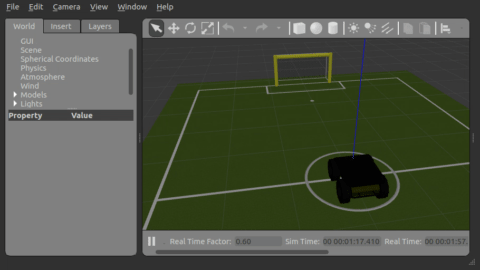

# Lesson #1


## What is ROS?

ROS (Robot Operating System) is the de facto standard for robot programming, is a middleware between your OS and your robot programming, usually made of multiple programs running potentially in different computers. 

4 elements:

1. Plumbing: ROS allows multiple individual programs (aka processes, nodes) running potentially in different computers to communicate and provides device drivers.
2. Basic tools to reuse: simulation, visualization, GUI, data logging
3. Off-the-shelf capabilities (control, planning, perception, mapping manipulation)
4. Ecosystem: software organized in packages, docs, tutorials.

## ROS philosophy

1. Peer to peer: individual programs communicate p2p over a defined API (ROS topics, services)
2. Distributed: comms run over wireless so nodes can be distributed in different machines
3. Multilingual: client libraries for C++, python, matlab, jva etc and you can mix and match
4. Lightweight: existing standalone libraries in thin ROS wrapper 
5. Free and open source

## ROS elements

### ROS workspace environment

Workspace environment defines context for current workspace

Load default workspace with 

```bash
$ source /opt/ros/noetic/setup.bash
```

Overlay your catkin workspace with 

```bash
$ cd ~/catkin_ws
$ source devel/setup.bash
```

check current workspace with 

```bash
$ echo $ROS_PACKAGE_PATH
```

See setup

```bash
$ cat ~/.bashrc
```

### ROS master

 [ROS master](https://wiki.ros.org/Master) is a special node that manages communication between nodes, every node registers at startup. Launched - among other elements - with: 

```bash
$ roscore
```

### ROS nodes

[ROS nodes]() are the single-purpose individual programs that make your robot programming. They are managed individually and organized in packages. 

Execute a node:

```bash
$ rosrun pkg_name node_name
```

List active nodes:

```bash
$ rosnode list
```

Show info on a node:

```bash
$ rosnode info node_name
```

### ROS topics

Once nodes register to master they can communicate over [ROS topics](https://wiki.ros.org/rostopic). Topics are names for streams of messages.

Nodes can publish or subscribe (listen) to topics - typically 1 to many

List active topics:

```bash
$ rostopic list
```

Subscribe to topic and show contents on the console

```bash
$ rostopic echo /topic
```

Analyze the frequency:

```bash
$ rostopic hz /topic
```

Show info on a topic:

```bash
$ rostopic info /topic
```

### ROS messages

[ROS messages](https://wiki.ros.org/Messages) structure and format is defined in a text file with `.msg` extension. Contains arrays of type `int`, `float`, `string` etc and can be nested (messages can contain other messages)  

See the type of a topic

```bash
$ rostopic type /topic
```

Manually publish a message to a topic (TAB for autocomplete)

```bash
$ rostopic pub /topic type args
```

## The `catkin build` system

Command to generate executables, libraries a interfaces: if you see in a tutorial `catkin_make` use instead `catkin build`. See [here](https://robotics.stackexchange.com/questions/16604/ros-catkin-make-vs-catkin-build) why `catkin build` is better than `catkin_make` and [here]() the official documentation of the `catkin_tools` package.

Note: Build packages from your catkin workspace and **then** always re-source to update the environment and ensure the system is aware of the changes:

```bash
$ cd ~/catkin_ws
$ catkin build pkg_name
$ source devel/setup.bash
```

This creates `src` folder for source code, `build` for cache and `devel` for built targets. Do not touch the last two. You can wipe them to start anew with: 

```bash
$ catkin clean
```

Note: Initially `catkin build` didn't work in my install but following [these instructions](https://stackoverflow.com/a/66142177/15472802) I installed a missing package:

```bash
$ sudo apt install python3-catkin-tools python3-osrf-pycommon
```

 Then deleted `devel` and `build` folders, run again and re-sourced environment et voilá.

## The good way of getting code from internet

This is cleaner when later you will have multiple `catkin_ws`

1. clone the repo to a `~/git` folder

```bash
$ cd ~/git
$ git clone https://github.com/ethz-asl/ros_best_practices
```

2. Symlink it to `catkin_ws`

```bash
$ ln -s ~/git/ros_best_practices/ ~/catkin_ws/src/
```

3. Build it and re-source environment

```bash
$ catkin build ros_package_template
$ source devel/setup.bash
```

4. execute it:

```bash
$ roslaunch ros_package_template ros_package_template.launch
```

## ROS launch

tool to launch several nodes at the same time. Launches `roscore` if not yet running. Described in XML `.launch` files. If in a package it will find it for you - dont need to be at the path. 

```bash
$ roslaunch pkg_name file_name.launch
```

Take a look at the file:

```xml
<launch>
  <node name="listener" pkg="roscpp_tutorials" type="listener" output="screen"/>
  <node name="talker" pkg="roscpp_tutorials" type="talker" output="screen"/>
</launch>
```

- `<launch>`: root element of the file

- `<node>`: a node to launch
  - `name`: name of the instance of node, free to choose
  - `pkg`: package
  - `type`: node executable
  - `output`:  where to write log messages, `screen` to console `log` to file
- `<arg>`: arguments
  - `ǹame`: name
  - `default`: default value if not passed
  - Are passed at launch with: `$ roslaunch launchfile.launch arg_name:=value`
  - Value can be accessed in launch file with `$(arg arg_name)`
- `<group if="condition">`: conditional loop
- `<ìnclude file ="pkg_name" />`: nest launch files
  - `$(find pkg_name)`: don't use absolute path but relative to packages, use this to find the system path to a package
  - `<arg name="arg_name" value="value"/>`: pass down arguments to nested file 

Note syntax of self-closing tags are <tag/> 

## Gazebo simulator

simulate 3D rigid body dynamics, sensors including noise, 3D visualization, interactive dropping elements etc. Tree with objects. Can start, pause, accelerate simu. Has gallery of robots and environments. Its a standalone program but has a ROS interface. 

Run it with :

```bash
$ rosrun gazebo_ros gazebo
```

End of Lesson #1

# Exercise #1

1. set up the Husky simulation:

http://wiki.ros.org/husky_gazebo/Tutorials/Simulating%20Husky

2. launch it and inspect it

```bash
$ rosnode list
$ rostopic list
$ rostopic echo /topic
$ rostopic hz /topic
$ rqt_graph
```

3. command a desired velocity:

```bash
 $ rostopic pub /cmd_vel geometry_msgs/Twist "linear:
  x: 5.0
  y: 0.0
  z: 0.0
angular:
  x: 0.0
  y: 0.0
  z: 0.0"
```

4. find online  `teleop_twist_keyboard`, clone it, compile from source (40%)

http://wiki.ros.org/teleop_twist_keyboard

```bash
$ cd ~/git
$ git clone https://github.com/ros-teleop/teleop_twist_keyboard.git # clone
$ ln -s ~/git/teleop_twist_keyboard/ ~/catkin_ws/src/ 			# symlink
$ catkin build teleop_twist_keyboard 							# compile from source
$ source devel/setup.bash 										# source environment
$ rosrun teleop_twist_keyboard teleop_twist_keyboard.py			# execute
Moving around:
   u    i    o
   j    k    l
   m    ,    .
$ roscd teleop_twist_keyboard									# check
$ pwd
~/catkin_ws/src/teleop_twist_keyboard							# ok!

```

5. write a launch file to launch simulation in a different world with teleop node and drive Husky (60%)

Launch file should replicate:

```bash
$ roslaunch husky_gazebo husky_empty_world.launch world_name:=worlds/willowgarage.world
$ rosrun teleop_twist_keyboard teleop_twist_keyboard.py
```

`my_husky.launch`:

```xml
<launch>
    <node name="teleop" pkg="teleop_twist_keyboard" type="teleop_twist_keyboard.py" output="screen"/>
    <include file ="$(find husky_gazebo)/launch/husky_empty_world.launch" >
        <arg name="world_name" value="worlds/robocup14_spl_field.world" />
    </include>
</launch>
```

Executed with:

```bash
$ roslaunch src/my_husky.launch
```


