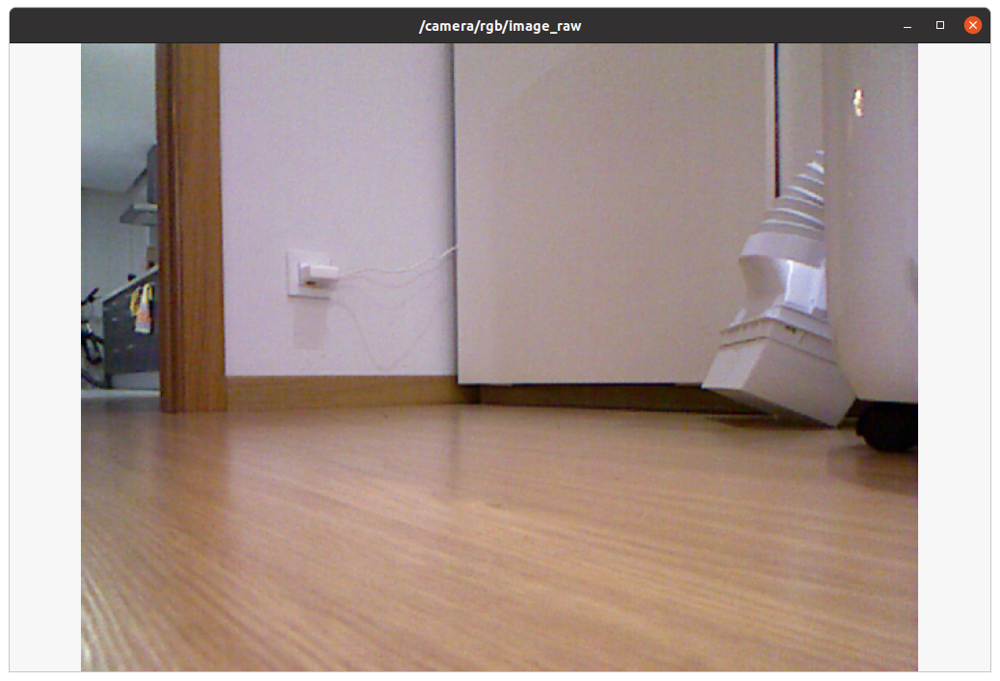
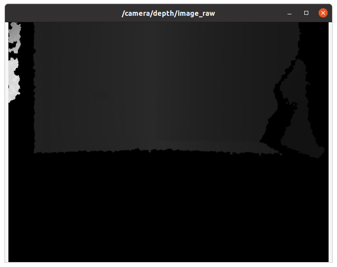

Date: 28.11

### Open CV Installation (#114-#117)

Update installation:

 ```bash
$ sudo apt-get update
$ sudo apt-get upgrade

 ```

OpenCV and tools to work with USB camera can be installled using: 

```bash
$ sudo apt-get install ros-noetic-vision-opencv
$ sudo apt-get install ros-noetic-usb-cam 
$ sudo apt-get install ros-noetic-image-view
```

The above is not needed in **ROS noetic** because it is already included. 

Check with 

```
$ python
>>> import cv2
```

Applied also instructions below to fix potential issue with `imshow`:

```
$ sudo apt-get install libopencv-*
$ pip3 install opencv-contrib-python
```

### (#118-#119): open/save images, pixel structure 

`test_cv2.py`demos how to open, display and copy images

pixel structure can be explored in interactive python   

```python
>>> import cv2
>>> import numpy as np
>>> img = cv2.imread("images/tomato.jpg")
>>> type(img)
<class 'numpy.ndarray'>
>>> img.shape
(200, 184, 3)
>>> img.size
110400
>>> len(img)
200
>>> img.dtype
dtype('uint8')

# extract pixel 10,20
>>> img[10][20]
array([248, 248, 248], dtype=uint8)

# shape of row 10
>>> img[10].shape
(184, 3)

# slice 2nd channel of image:
>>> img[:,:,1]
```

### Image encoding

* Grayscale: 1 channel (0 black - 255 white)

* BG:  3 channels Blue Green Red  (0 black - 255 white)

* HSV (Hue is color in 0-360 degrees, Saturation 0-100%, Value or Brightness 0-100%)

| Color   | Hue range degrees |
| ------- | ----------------- |
| Red     | 0-60              |
| Yellow  | 60-120            |
| Green   | 120-180           |
| Cyan    | 180 -240          |
| Blue    | 240-300           |
| Magenta | 300-360           |

### Assignment 6

See folder./ball-detection/

---


Date: 16.12

## Installing the Kinect on Ubuntu and ROS noetic

Generally followed this article: https://aibegins.net/2020/11/22/give-your-next-robot-3d-vision-kinect-v1-with-ros-noetic/

Note: `sudo nano ..`does not work with `atom` gives `mkdir missing argument` error , why? 

To solve `resource not found error` when `roslaunch` follow these instructions:

https://get-help.robotigniteacademy.com/t/resource-not-found-rgbd-launch-using-kinect-using-ros-noetic/12527

Check out really interesting links at the end of the **aibegins** article for where to go next:

1. https://doc.bwbot.org/zh-cn/books-online/xq-manual-en/topic/557.html, one of the chapters of the Xiaoqiang ROS robot user manual, worth exploring https://doc.bwbot.org/en/
2. https://naman5.wordpress.com/2014/06/24/experimenting-with-kinect-using-opencv-python-and-open-kinect-libfreenect/ install python wrapper, see next section
3. http://www.choitek.com/uploads/5/0/8/4/50842795/ros_kinect.pdf one of the ROS tutorials for the MMM robot: https://github.com/Choitek/mmmros-docs
4. http://wiki.ros.org/ROS/Tutorials/CreatingPackage

### Installing the python wrapper:

https://naman5.wordpress.com/2014/06/24/experimenting-with-kinect-using-opencv-python-and-open-kinect-libfreenect/

Gives error: `freenect no module found` 

Checked this discussion: [freenect no module found #550](https://github.com/OpenKinect/libfreenect/issues/550)

but the issue seems to be this line: 

```bash
sudo python setup.py install
```

which should be instead:

```bash
sudo python3 setup.py install
```

(`cython` uninstalled `python-is-python3`)

---

Date: 20-21.12

### (#131-134) Recap of Section 15: Laser Range Finders

Range finders such as laser scanners or ultrasonic sensors are used in SLAM, Obstacle avoidance and Navigation

### Laser Scanner characteristics

Field of view: +/- degrees scanned (e.g. +/- 120degrees)

Angular resolution (angular distance between individual measurements)

Time increment (time between individual measurements)

Scan frequency in Hz (or msecs/scan) 10 - 50Hz

Range: min and max range (e.g. 0.1 - 5m indoors or 1-30m outdoor)

Voltage: 5V - 12V

Price 500 - 5000$

Example brands: Luminar, Velodyne, Hokuyo, Sick

Cheap alternative: RGBD cameras: see https://rosindustrial.org/3d-camera-survey/ 

Stereo Camera + laser for depth, price around 200$ 

See also:

http://wiki.ros.org/Industrial/Tutorials#External_Package_Tutorials
http://wiki.ros.org/Industrial/supported_hardware
https://github.com/ros-industrial

Typically a scanner returns a list of ranges and a list of intensities

### Using Kinect as laser scanner (alternative to #136 and #137)

#### 1. Install Kinect drivers

Follow the instructions in this [article in aibegins](https://aibegins.net/2020/11/22/give-your-next-robot-3d-vision-kinect-v1-with-ros-noetic/) to install from source. I had an error `Resource not found: rgdb_launch`, solution found [here](https://get-help.robotigniteacademy.com/t/resource-not-found-rgbd-launch-using-kinect-using-ros-noetic/12527) to install the missing component:

```bash
$ sudo apt install ros-noetic-rgbd-launch
```

[How to get started using the Kinect with ROS](https://www.youtube.com/watch?v=cjC5tXpVXzE) describes a simpler alternative to install the drivers with apt-get:

```bash
$ sudo apt-get install libfreenect-dev
$ sudo apt-get ros-noetic-freenect-launch 
```

#### 2. Connect the Kinect RGBD camera and start the drivers :

```bash
$ roslaunch freenect_launch freenect.launch
```

**NOTE: if called with parameter `depth_registration:=true` as described in the [aibegins article](https://aibegins.net/2020/11/22/give-your-next-robot-3d-vision-kinect-v1-with-ros-noetic/) depth info seems empty... Why?**

A lot of topics are available!

```
$ rostopic list
/camera/depth/camera_info
/camera/depth/disparity
/camera/depth/image
/camera/depth/image/compressed
/camera/depth/image/compressed/parameter_descriptions
/camera/depth/image/compressed/parameter_updates
...
/camera/rgb_rectify_mono/parameter_updates
/diagnostics
/rosout
/rosout_agg
/tf
/tf_static

```

```bash
$ rosrun image_view image_view image:=/camera/rgb/image_raw
```



```bash
$ rosrun image_view image_view image:=/camera/depth/image_raw
```



(Note: For some reason this did not work initially, but it worked after unplugging / plugging and restarting the drivers without the `depth_registration:=true` parameter) 

Now we can communicate but will only get a 3D point cloud. For navigation we will need to convert to a laser scan.

#### 3. Convert depth image to laser scan

Install `depthimage_to_laserscan` package (instructions found [here](https://books.google.es/books?id=BlA_EAAAQBAJ&pg=PA353&lpg=PA353&dq=how+to+install+depthimage_to_laserscan+ros+noetic&source=bl&ots=-fNNLxwzoy&sig=ACfU3U13kmNnEwTOVUeVa7CamJCC8fwh3Q&hl=en&sa=X&ved=2ahUKEwiJieHYrPP0AhUD_RQKHbxtC2UQ6AF6BAgcEAM#v=onepage&q=how%20to%20install%20depthimage_to_laserscan%20ros%20noetic&f=false)) with:

```bash
$ sudo apt install ros-noetic-depthimage-to-laserscan
```

Alternative, also valid (what is the difference?)

```bash
$ sudo apt-get ros-noetic-depthimage-to-laserscan 
```


Then run it with:

```bash
$ rosrun depthimage_to_laserscan depthimage_to_laserscan image:=/camera/depth/image_raw
```


The exact same result can be achieved with the following launch file `depth_image_to_laser.launch`:

```xml
<launch>
	<node name ="depthimage_to_laserscan"
			pkg="depthimage_to_laserscan" type="depthimage_to_laserscan">
		<remap from="image" to="/camera/depth/image_raw"/>
	</node>
</launch>
```

Note: Launch files are XML files that allow to start nodes, specify their parameters and rename (remap) topics. The launch file can then be called as follows:

```bash
$ roslaunch ros_essentials_cpp depth_image_to_laser.launch
```

### 4. Test with `rostopic` echo and visualize  with `rviz` 

After this the `/scan` topic is available, and can be seen with:

```bash
$ rostopic list
/camera/depth/camera_info
/camera/depth/disparity
/camera/depth/image
/camera/depth/image/compressed
/camera/depth/image/compressed/parameter_descriptions
/camera/depth/image/compressed/parameter_updates
...
/camera/rgb_rectify_mono/parameter_updates
/diagnostics
/rosout
/rosout_agg
/scan
/tf
/tf_static
```

and also the content can be printed with:

```bash
$ rostopic echo /scan
header: 
  seq: 64
  stamp: 
    secs: 1640038712
    nsecs: 842923390
  frame_id: "camera_depth_frame"
angle_min: -0.513185441493988
angle_max: 0.4999069571495056
angle_increment: 0.0015854340745136142
time_increment: 0.0
scan_time: 0.032999999821186066
range_min: 0.44999998807907104
range_max: 10.0
ranges: [nan, nan, {...} , 0.7862579226493835, 0.7857072949409485, 0.7884752750396729, 0.7879186868667603, {...} , nan, nan]
intensities: []
---
{...}
```


Launch `rviz` visualization tool:

```bash
$ rosrun rviz rviz
```

Set **Fixed Frame** to `camera_link`

**Add** --> **LaserScan**, set **Topic** to `/scan`

**Add** --> **Camera**, set **Image Topic** to `/camera/rgb/image_mono`

**Add** --> **Axes**

**Add** --> **PointCloud2**, set **Topic** to `/camera/depth_registered/points`

### 5. (#137) Save data with `rosbag` 


```
$ mkdir ~/Desktop/udemy-ROS-course/bagfiles
$ cd ~/Desktop/udemy-ROS-course/bagfiles
$ rosbag record -a
```

```
$ rosbag info 2021-12-21-00-00-02.bag 
path:        2021-12-21-00-00-02.bag
version:     2.0
duration:    26.6s
start:       Dec 21 2021 00:00:03.98 (1640041203.98)
end:         Dec 21 2021 00:00:30.55 (1640041230.55)
size:        867.8 MB
messages:    3517
compression: none [462/462 chunks]
types:       diagnostic_msgs/DiagnosticArray       [60810da900de1dd6ddd437c3503511da]
             dynamic_reconfigure/Config            [958f16a05573709014982821e6822580]
             dynamic_reconfigure/ConfigDescription [757ce9d44ba8ddd801bb30bc456f946f]
             rosgraph_msgs/Log                     [acffd30cd6b6de30f120938c17c593fb]
             sensor_msgs/CameraInfo                [c9a58c1b0b154e0e6da7578cb991d214]
             sensor_msgs/CompressedImage           [8f7a12909da2c9d3332d540a0977563f]
             sensor_msgs/Image                     [060021388200f6f0f447d0fcd9c64743]
             sensor_msgs/LaserScan                 [90c7ef2dc6895d81024acba2ac42f369]
             sensor_msgs/PointCloud2               [1158d486dd51d683ce2f1be655c3c181]
             stereo_msgs/DisparityImage            [04a177815f75271039fa21f16acad8c9]
             tf2_msgs/TFMessage                    [94810edda583a504dfda3829e70d7eec]
             theora_image_transport/Packet         [33ac4e14a7cff32e7e0d65f18bb410f3]
topics:      /camera/depth/camera_info                                                                       57 msgs    : sensor_msgs/CameraInfo               
             /camera/depth/disparity                                                                         41 msgs    : stereo_msgs/DisparityImage           
             /camera/depth/image                                                                             45 msgs    : sensor_msgs/Image                    
             /camera/depth/image/compressed/parameter_descriptions                                            {...}                                                                         
28 msgs    : diagnostic_msgs/DiagnosticArray      
             /rosout                                                                                        730 msgs    : rosgraph_msgs/Log                     (2 connections)
             /rosout_agg                                                                                    730 msgs    : rosgraph_msgs/Log                    
             /scan                                                                                           55 msgs    : sensor_msgs/LaserScan                
             /tf_static                                                                                       4 msgs    : tf2_msgs/TFMessage                    (4 connections)

```

```bash
$ rosbag play 2021-12-21-00-00-02.bag
```

### 6. (#138) Write subscriber ROS node to `/scan` (in python)

See solution in  `~/catkin_ws/src/mhered/src/scan_subscriber.py`

Edited to improve cleanup of Inf and NaN values on 07.12.2022


Specs of `sensor_msgs.msg/LaserScan` message: http://docs.ros.org/en/noetic/api/sensor_msgs/html/msg/LaserScan.html

replace ranges > range_max with range_max and replace ranges < range_min

```
ranges = np.clip(message.ranges, message.range_min, message.rangesrange_max)
```

Check that `(angle_max -angle_min) // angle_increment = len(ranges)`

Then `angle_i = angle_min + angle_increment * index`

### Assignment 7

See details in [ROS_Assignment_7](./ROS_Assignment_7.md)
