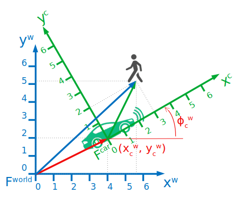
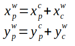
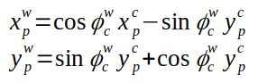
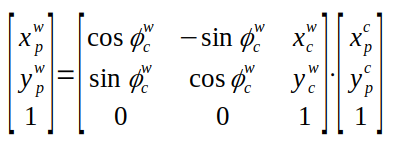
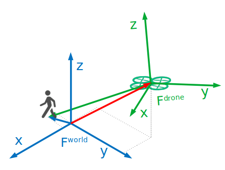
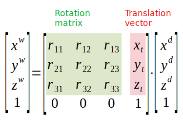
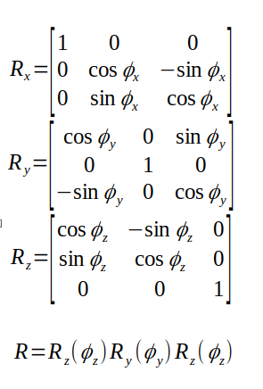

### (#003) Installation

Check that the navigation stack and SLAM packages are installed or install them manually with

```bash
$ sudo apt-get install ros-noetic-navigation
$ sudo apt-get install ros-noetic-slam-gmapping
```

### (#004-006) Installation and overview of Turtlebot3

Same as lessons #111-113 of ROS1 course and [Turtlebot.pdf](./course-materials/111-Turtlebot3.pdf ), notes [here](./2.ROS-essentials-Motion-Nov21-L82-112.md).

#### Example 1 - manually move a robot w/ keyboard in a maze world visualizing in RVIZ (lidar + camera):

Terminal 1: `roslaunch turtlebot3_gazebo turtlebot3_world.launch`  (or simply: `$ tb3maze` using the `~/.bashrc` shortcut)

Terminal 2:`$ roslaunch turtlebot3_gazebo turtlebot3_gazebo_rviz.launch`

Terminal 3: `roslaunch turtlebot3_teleop turtlebot3_teleop_key.launch`  (or simply `$ tb3teleop`).

Increase size of scan points from 0.01 to 0.04

```bash
$ rosnode list
/gazebo
/gazebo_gui
/robot_state_publisher
/rosout
/rviz
/turtlebot3_teleop_keyboard
```

#### Example 2: SLAM for MAP building:

Terminal 1:`$ roslaunch turtlebot3_slam turtlebot3_slam.launch slam_methods:=gmappping`

Terminal 2: `roslaunch turtlebot3_teleop turtlebot3_teleop_key.launch`  (or simply `$ tb3teleop`).

### (#008) Install course github repo

```bash
$ cd ~/catkin_ws/src/
$ git clone https://github.com/aniskoubaa/ros_course_part2.git
cd ~/catkin_ws && catkin_make
```

### (#009-014) Launch navigation demo

1. Note on path setting for map files: In the file `tb3_house_map.yaml` the first line must point to the full path of the map file `tb3_house_map.pgm`, e.g.

   ````yaml
   image: /home/mhered/catkin_ws/src/ros_course_part2/src/topic03_map_navigation/tb3map/tb3_house_map.pgm
   ````

2)  Launch gazebo

   ```bash
   $ roslaunch turtlebot3_gazebo turtlebot3_house.launch
   ```

   Or using the alias: `$ tb3house`

3) Select waffle robot if not selected

   ```bash
   $ export TURTLEBOT3_MODEL=waffle
   ```

   With the alias simply `$ waffle`

4) Run the navigation stack with the map file for **RVIZ** pointing to the full path of the `tb3_house_map.yaml` file:

```
$ roslaunch turtlebot3_navigation turtlebot3_navigation.launch map_file:=/home/mhered/catkin_ws/src/ros_course_part2/src/topic03_map_navigation/tb3map/tb3_house_map.yaml
```

### (#15) Initial robot location

Comparing Gazebo (left image, the "reality" in this case) with RVIZ (right image, the robot perception) there is a mismatch. This is because the robot needs an estimate of its initial pose, otherwise does not know how to match the map with the environment. The robot believes that its location is on the green arrow, when it is on the red arrow. The top yellow arrow shows the shift needed to correct this error. Note that the laserscan information (the green dots represent where the laserscan hits the walls) also appear shifted from the map also by the same amount (bottom yellow arrow) .


Tell the robot its current location and orientation clicking on **2D Pose Estimate**. After repositioning the map, check that both the robot location and the laserscan match with the map, see below:


5. See [RVIZ documentation](http://wiki.ros.org/rviz/UserGuide#The_different_camera_types) to understand how to manipulate the different camera views (use left, middle and right mouse clicks and scroll).  I found orthogonal view frustrating at the beginning because it is always looking down. Note as well that the mouse-clicks are slightly different in Gazebo.


MP4 video (with sound ) available in [assets/videos/](./assets/videos)SLAM_fun.mp4

### (#016-017) Frames

To visualize in **RVIZ** the different reference frames click **Add** -> **TF**:

*  `map` Fixed global frame related to the map of the environment, origin of the grid: (0, 0) is at the centre.

*  `odom` odometry reference frame. Note: `odom`frame is shifted vs `map` frame!

*  Several frames attached to the robot.

Topics:

`/amcl_pose` global pose of the robot in `map` ref frame

`/odom`: pose and twist of the robot based in odometry information. Expressed in `odom` frame, related to the odometry of the robot. It  represents a relative location rather than a global location.  Topic contains a timestamp, `frame_id` is reference frame , pose, twist.


```
$ rostopic echo /odom
...
---
header:
  seq: 169794
  stamp:
    secs: 5659
    nsecs: 834000000
  frame_id: "odom"
child_frame_id: "base_footprint"
pose:
  pose:
    position:
      x: 3.05850913877631
      y: 1.8567955432643994
      z: -0.0010082927066695398
    orientation:
      x: -0.0006763989802751724
      y: 0.00144164541567888
      z: 0.4239865358476224
      w: 0.9056670920171759
  covariance: [1e-05, 0.0, 0.0, 0.0, 0.0, 0.0, 0.0, 1e-05, 0.0, 0.0, 0.0, 0.0, 0.0, 0.0, 1000000000000.0, 0.0, 0.0, 0.0, 0.0, 0.0, 0.0, 1000000000000.0, 0.0, 0.0, 0.0, 0.0, 0.0, 0.0, 1000000000000.0, 0.0, 0.0, 0.0, 0.0, 0.0, 0.0, 0.001]
twist:
  twist:
    linear:
      x: 3.3582185509467775e-07
      y: -9.832493355169816e-07
      z: 0.0
    angular:
      x: 0.0
      y: 0.0
      z: -9.519550506846002e-06
  covariance: [0.0, 0.0, 0.0, 0.0, 0.0, 0.0, 0.0, 0.0, 0.0, 0.0, 0.0, 0.0, 0.0, 0.0, 0.0, 0.0, 0.0, 0.0, 0.0, 0.0, 0.0, 0.0, 0.0, 0.0, 0.0, 0.0, 0.0, 0.0, 0.0, 0.0, 0.0, 0.0, 0.0, 0.0, 0.0, 0.0]
---
...
```

---

### (#018) Quaternions

Default ROS orientation representation is quaternion (x,y,z,w), not as easy to interpret as roll, pitch, yaw

### (#019) Navigation

1. Click **2D Nav Goal** to define target pose on map.
2. Static global planner: first ROS plans a **static path** avoiding static obstacles
3. Dynamic local planner: then ROS executes the path wit the local path planner which avoids also dynamic obstacles

Configuration of navigation parameters is key to a good performance.

Recap of map-based robot navigation:

* First, localize the robot in its correct initial location using **2D Pose Estimate**.

* Send a goal location to the robot using **2D Nav Goal** and  the robot will head towards the destination location. The navigation stack of ROS is responsible for the planning and the execution of the path.

### (#021-027) 2D Pose and Transformations 

2D Pose = Position x,y + orientation theta with reference to a frame of coordinates F

The robot can locate itself (e.g. with GPS or odometry) and locate other objects with respect to itself through sensors (e.g LIDAR or a camera). Then what is the location of the person in the world frame?



* Location and orientation of car frame (x, y, phi)^w_c  in the world frame F^world 
* Location of person (x, y) in the car frame F^car

For pure translation (x_t, y_t), the 2D Frame transformation is: 



For pure rotation (phi_t), the 2D Frame transformation is:



The general transformation matrix, using homogeneous coordinates (x,y,1):



### (#028-035) 3D Pose and Transformations

Right-hand rule to assign sign to Z-axis.


* Rotation around the X-axis **Rx**: roll or bank

* Rotation around the Y-axis **Ry**: pitch or attitude

* Rotation around the Z-axis **Rz**: yaw or heading

The 3D transformation matrix can be obtained from a 3D Rotation matrix **R** and a 3D Translation Vector **t**:





* The 3D Rotation matrix **R** can be obtained as the product of the three unitary rotations:




3 methods to represent a 3D rotation. 

*  **Euler** angles or Three-angle representation. Easy to interpret. Two basic types:

  * Euler rotations: may involve repetition (but not successive) of rotations about one axis (XYX, XZX, YXY, YZY, ZXZ, ZYZ). Consequence of Euler theorem.
  * Cardan rotations: particular case where the 3 axes are involved (XYZ, XZY, YXZ, YZX, ZXY, ZYX)

* Rotation about **arbitrary vector**: for any 3D rotation there exists an axis around which this the rotation occurs. Rodrigues Formula allows to determine the 3D rotation matrix from the 3D vector **u** describing the axis and the angle rotated theta

* **Quaternions** describe 3D rotation with a  vector (x,y,z) and a scalar w. Notation in ROS is (x, y, z, w)

  q = x · **i** + y · **j** + z · **k** + w , where **i**, **j**, **k** are unit vectors

It is possible to obtain any one representation from any other (Euler angles,  arbitrary vector, quaternion, and 3D rotation matrix). Quaternions are often preferred in many applications because they are simpler, more compact, numerically more stable, more efficient and avoid gimbal lock. Drawback: not intuitive.

### (#036-) TF package

TF: transformation library in ROS

Performs the computations for transformations between frames, allowing to compute the pose of any object in any frame. Also provides an API for python and C++ to publish and listen to frames in ROS.

ROS convention for axes: X: red. Y: Green, Z: Blue

A robot is defined as collection of frames attached to its different joints and components. URDF: unified robot description format, XML file that describes the robot, see http://wiki.ros.org/urdf/Tutorials

Some ROS nodes in TF package that provide utilities:

#### `view_frames` 

Graphical debugging tool that saves in PDF a graph of the current full tree of transform frames

Typical usage is to generate the PDF then view it:

```
$ rosrun tf view_frames
$ evince frames.pdf
```

Hence it is useful to add a shortcut to `.bashrc`:

```
alias tf='cd /var/tmp && rosrun tf view_frames && evince frames.pdf &'
```

See also `rqt_tf_tree` that allows dynamic introspection

* `map` global frame

* `odom` frame relative to odometry

* `base_footprint` attached tobase of the robot at its centre

#### `tf_monitor`

Monitor transforms between frames

```bash
$ rosrun tf tf_monitor
```

#### `tf_echo`

Prints to screen the specified transform between any two frames

```
$ rosrun tf tf_echo <source frame> <target frame>
```

Provides translation and rotation (in quaternion, RPY (roll-pitch-yaw))

#### Other

* `roswtf`: with the `tfwtf` plugin helps debug tf issues
* `static_transform_published`: command line tool to send static transforms

Convention: TF methods use angles in radians

```python
import math
import tf

roll = math.radians( 25 )
pitch = math.radians( 30 )
yaw = math.radians( 45 )

quaternion = tf.transformations.quaternion_from_euler(roll, pitch, yaw)
rpy = tf.transformations.euler_from_quaternion(quaternion)
roll=math.degrees(rpy[0])
pitch=math.degrees(rpy[1])
yaw=math.degrees(rpy[2])
```

Two topics represent robot location and orientation:

`/odom` (re. odometry)

uses `nav_msgs/OdometryMessage`  messages including a `Header`, a `geometry_msgs/PoseWithCovariance` (position, orientation represented by a quaternion and covariances) and a `geometry_msgs/TwistWithCovariance`(linear velocities, angular velocities and covariances)

 `/acml_pose` (global location re. `map` frame)

uses `geometry_msgs/PoseWithCovarianceStamped` messages ingluding a `Header` and a `geometry_msgs/PoseWithCovariance` (position, orientation represented by a quaternion and covariances )
