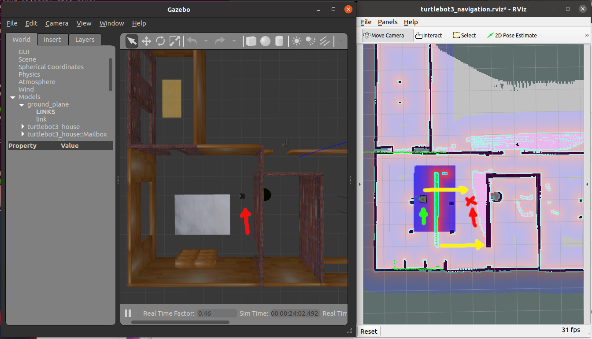
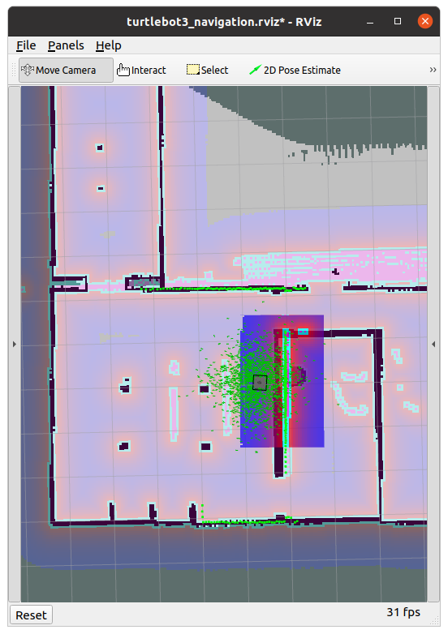
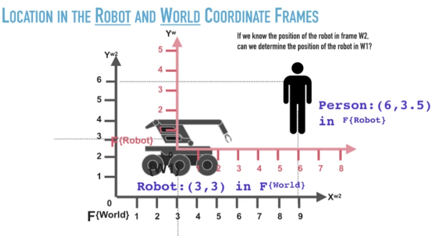
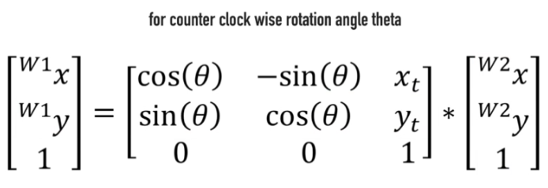

### (#003) Installation

Check that the navigation stack and SLAM packages are installed or install them manually with

```bash
$ sudo apt-get install ros-noetic-navigation
$ sudo apt-get install ros-noetic-slam-gmapping
```

### (#004-006) Installation and overview of Turtlebot3

Same as lessons #111-113 of ROS1 course and [Turtlebot.pdf](./course-materials/111-Turtlebot3.pdf ), notes [here](./2.ROS-essentials-Motion-Nov21-L82-112.md).

#### Example 1 - manually move a robot w/ keyboard in a maze world visualizing in RVIZ (lidar + camera):

Terminal 1: `roslaunch turtlebot3_gazebo turtlebot3_world.launch`  (or simply: `$ tb3maze` using the `~/.bashrc` shortcut)

Terminal 2:`$ roslaunch turtlebot3_gazebo turtlebot3_gazebo_rviz.launch`

Terminal 3: `roslaunch turtlebot3_teleop turtlebot3_teleop_key.launch`  (or simply `$ tb3teleop`).

Increase size of scan points from 0.01 to 0.04

```bash
$ rosnode list
/gazebo
/gazebo_gui
/robot_state_publisher
/rosout
/rviz
/turtlebot3_teleop_keyboard
```

#### Example 2: SLAM for MAP building:

Terminal 1:`$ roslaunch turtlebot3_slam turtlebot3_slam.launch slam_methods:=gmappping`

Terminal 2: `roslaunch turtlebot3_teleop turtlebot3_teleop_key.launch`  (or simply `$ tb3teleop`).

### (#008) Install course github repo

```bash
$ cd ~/catkin_ws/src/
$ git clone https://github.com/aniskoubaa/ros_course_part2.git
cd ~/catkin_ws && catkin_make
```

### (#009-014) Launch navigation demo

1. Note on path setting for map files: In the file `tb3_house_map.yaml` the first line must point to the full path of the map file `tb3_house_map.pgm`, e.g.

   ````yaml
   image: /home/mhered/catkin_ws/src/ros_course_part2/src/topic03_map_navigation/tb3map/tb3_house_map.pgm
   ````

2)  Launch gazebo

   ```bash
   $ roslaunch turtlebot3_gazebo turtlebot3_house.launch
   ```

   Or using the alias: `$ tb3house`

3) Select waffle robot if not selected

   ```bash
   $ export TURTLEBOT3_MODEL=waffle
   ```

   With the alias simply `$ waffle`

4) Run the navigation stack with the map file for **RVIZ** pointing to the full path of the `tb3_house_map.yaml` file:

```
$ roslaunch turtlebot3_navigation turtlebot3_navigation.launch map_file:=/home/mhered/catkin_ws/src/ros_course_part2/src/topic03_map_navigation/tb3map/tb3_house_map.yaml
```

### (#15) Initial robot location

Comparing gazebo (the "reality" in this case) with RVIZ we see the robot cannot tell where it is. It thinks it is in the green arrow, when in relaity it is in the red arrow. There yellow arrows show error. Note the green dots of the laserscan hitting the walls is also shifted from the map by the same amount.



Tell the robot its initial location and orientation clicking on **2D Pose Estimate**. After repositioning the walls are detected properly.



5. See [RVIZ documentation](http://wiki.ros.org/rviz/UserGuide#The_different_camera_types) to understand how to manipulate the different camera views (use left, middle and right buttons and scroll). Different in gazebo. Also orthogonal view always looking down.


Full MP4 video (with :notes: ) available in [assets/videos/](./assets/videos)SLAM_fun.mp4

### (#016-017) Frames

To visualize in **RVIZ** the different reference frames click **Add** -> **TF**:

*  `map` Fixed global frame related to the map of the environment, origin of the grid: (0, 0) is at the centre.

*  `odom` odometry reference frame. Note: `odom`frame is shifted vs `map` frame!

*  Several frames attached to the robot.

Topics:

`/amcl_pose` global pose of the robot in `map` ref frame

`/odom`: pose and twist of the robot based in odometry information. Expressed in `odom` frame, related to the odometry of the robot. It  represents a relative location rather than a global location.  Topic contains a timestamp, `frame_id` is reference frame , pose, twist.


```
$ rostopic echo /odom
...
---
header:
  seq: 169794
  stamp:
    secs: 5659
    nsecs: 834000000
  frame_id: "odom"
child_frame_id: "base_footprint"
pose:
  pose:
    position:
      x: 3.05850913877631
      y: 1.8567955432643994
      z: -0.0010082927066695398
    orientation:
      x: -0.0006763989802751724
      y: 0.00144164541567888
      z: 0.4239865358476224
      w: 0.9056670920171759
  covariance: [1e-05, 0.0, 0.0, 0.0, 0.0, 0.0, 0.0, 1e-05, 0.0, 0.0, 0.0, 0.0, 0.0, 0.0, 1000000000000.0, 0.0, 0.0, 0.0, 0.0, 0.0, 0.0, 1000000000000.0, 0.0, 0.0, 0.0, 0.0, 0.0, 0.0, 1000000000000.0, 0.0, 0.0, 0.0, 0.0, 0.0, 0.0, 0.001]
twist:
  twist:
    linear:
      x: 3.3582185509467775e-07
      y: -9.832493355169816e-07
      z: 0.0
    angular:
      x: 0.0
      y: 0.0
      z: -9.519550506846002e-06
  covariance: [0.0, 0.0, 0.0, 0.0, 0.0, 0.0, 0.0, 0.0, 0.0, 0.0, 0.0, 0.0, 0.0, 0.0, 0.0, 0.0, 0.0, 0.0, 0.0, 0.0, 0.0, 0.0, 0.0, 0.0, 0.0, 0.0, 0.0, 0.0, 0.0, 0.0, 0.0, 0.0, 0.0, 0.0, 0.0, 0.0]
---
...
```

---

### (#018) Quaternions

Default ROS orientation representation is quaternion (x,y,z,w), not as easy to interpret as roll, pitch, yaw

### (#019) Navigation

1. Click **2D Nav Goal** to define target pose on map.
2. Static global planner: first ROS plans a **static path** avoiding static obstacles
3. Dynamic local planner: then ROS executes the path wit the local path planner which avoids also dynamic obstacles

Configuration of navigation parameters is key to a good performance.

Recap of map-based robot navigation:

* First, localize the robot in its correct initial location using **2D Pose Estimate**.

* Send a goal location to the robot using **2D Nav Goal** and  the robot will head towards the destination location. The navigation stack of ROS is responsible for the planning and the execution of the path.

### (#021-027) 2D Pose and Transformations 

2D Pose = Position x,y + orientation theta with reference to a frame of coordinates F

The robot can locate itself e.g. with odom and locate other objects with respect to itself through sensors e.g camera). What is the location of the person in the world frame?



* location of robot in world frame F_w: (x_w ,y_w ,theta_w) 

* location of person in robot frame F_r: (x_r ,y_r ,theta_r) 

2D Frame transformation = pure translation (x_t, y_t)

x_w = x_r + x_t

y_w = y_r + y_t

 2D Frame transformation = pure rotation (theta_t)

x_w = x_r*cos(theta) - y_r * sin(theta)

y_w = x_r * sin(theta) +y_r*cos(theta) 

General transformation matrix, using homogeneous coordinates (x,y,1):



### (#028) Next: 3D Pose and Transformations
