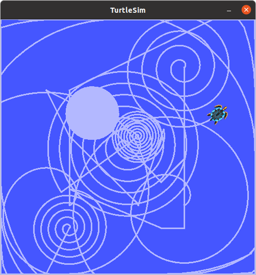
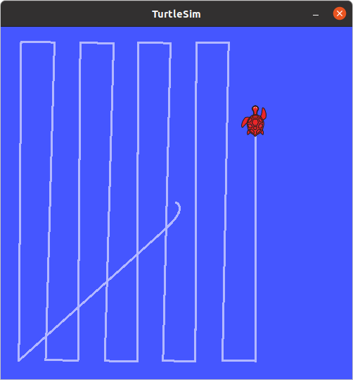

### Create package

```bash
~/catkin_ws/src$ catkin_create_pkg cleaning_robot std_msgs rospy roscpp
Created file cleaning_robot/package.xml
Created file cleaning_robot/CMakeLists.txt
Created folder cleaning_robot/include/cleaning_robot
Created folder cleaning_robot/src
Successfully created files in /home/mhered/catkin_ws/src/cleaning_robot. Please adjust the values in package.xml.

```

### Not Needed: Update dependencies in `CMakeLists.txt`

In `~/catkin_ws/src/cleaning_app/CMakeLists.txt`: 

1. in `find_package(catkin REQUIRED COMPONENTS`add add the library  `message_generation` to the list of dependencies 
2. in the entry `catkin_package`, add `message_runtime` to `CATKIN_DEPENDS` 
3. activate the entry `generate_messages` and list there dependencies of the generated messages, e.g. if the _fieldtypes_ include previously created messages in other packages. 

### Not Needed: Update dependencies in `package.xml`

1. in the manifest `~/catkin_ws/src/mhered/package.xml` add the following lines in the appropriate places to update dependencies:
   1. `<build_depend>message_generation</build_depend>` and 
   2. `<exec_depend>message_runtime</exec_depend>`

### Compile

```bash
~/catkin_ws$ catkin_make
```

Write `move()`


----

Date: 16.11

(#89 - 107)

Finish `rotate()`, `go_to()`

Read about `set_orientation()` and `spiral()`

Read about launch files


----

Date: 17.11

Write `spiral()`,  `set_orientation()` , `cleaner()`





launch files

